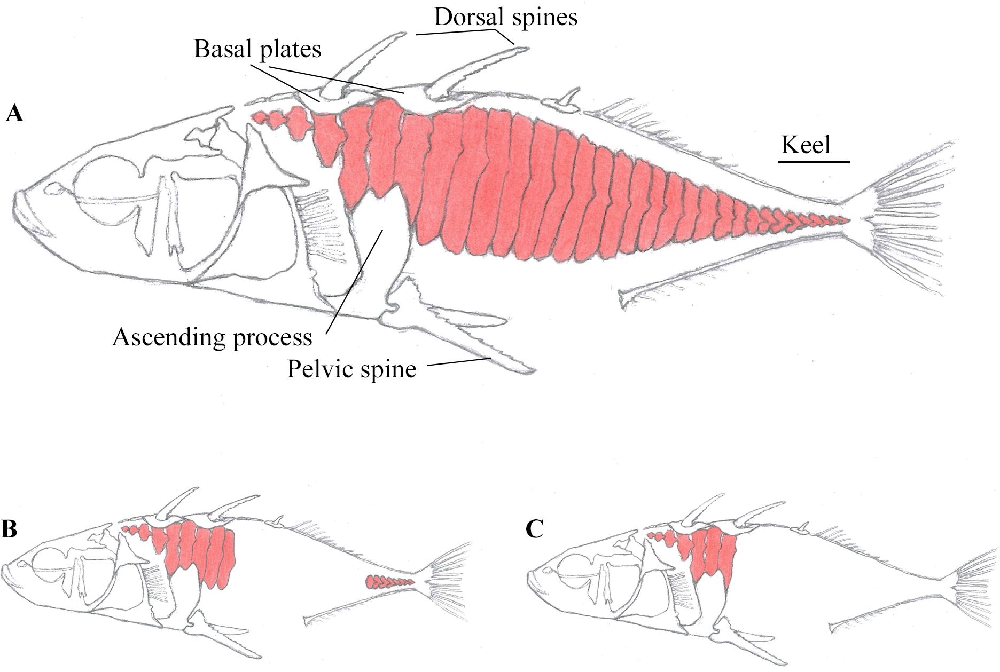

## Exercise 1: Clinical trials

A clinical trial was conducted to study the effect of the levels of a drug on some measure of well-being (called ```SCORE``` in this case). Both male and female subjects were randomly choosen for the study and then randomly assigned to to either a low or a high ```DOSE``` treatment. 

To read this data, directly from the web, into an object called ```drugTrials```, do the following in R:


```r
drugTrials <- read.csv("https://git.io/JewAf")
```

Make sure the data is read in correctly. If it is read correctly, there should be 48 rows and 4 columns (we don't need the first column which is unique ID for each individual).

1.) Perform some exploratory analysis on the data set and answer the following questions: (a) Do you think the SCOREs are different between genders? (b) are SCOREs different between differend doses of the drug? (c) is there an interaction between GENDER and DOSE? (d) is this data set balanced (i.e. equal observations across all subgroups)?


```r
# make a boxplot for all 4 subgroups
require(ggplot2)
```

```
## Loading required package: ggplot2
```

```r
p <- ggplot(drugTrials, aes(x = DOSE, y = SCORE, fill = GENDER)) + geom_boxplot(position = position_dodge(1)) + 
    stat_summary(fun.y = mean, geom = "line", aes(group = GENDER), position = position_dodge(1)) + 
    stat_summary(fun.y = mean, geom = "point", position = position_dodge(1)) + theme_bw()
p
```


It is difficult to discern any main effects here - they all seem to be context dependent which suggests there is an interaction between DOSE and GENDER in determing the SCORE

is the dataset balanced?

```r
table(drugTrials$GENDER, drugTrials$DOSE)
```

```
##         
##          high low
##   female   12  12
##   male     12  12
```
Yes it is, which means when you can the ```aov()``` function to generate the 2-way ANOVA table


2.) Carry out a two-way ANOVA with interaction on this data set and answer the following questions (a) Is the interaction effect signficant? (b) are any of the main effects signficant? (c) if the interaction is signficant can you still easily interpret the results for any significant main effects?


```r
drug_anova <- aov(SCORE ~ GENDER * DOSE, data = drugTrials)
summary(drug_anova)
```

```
##             Df Sum Sq Mean Sq F value   Pr(>F)    
## GENDER       1  93.52   93.52  37.494 2.22e-07 ***
## DOSE         1   6.02    6.02   2.414 0.127433    
## GENDER:DOSE  1  38.52   38.52  15.443 0.000297 ***
## Residuals   44 109.75    2.49                     
## ---
## Signif. codes:  0 '***' 0.001 '**' 0.01 '*' 0.05 '.' 0.1 ' ' 1
```
Always start from the bottom (the interaction term), which is signficant (F_1,44 = 15.4, p-value= 0.0003). The main effect of gender is also signicant, but it is not possible to say that Males are different from Females for SCORES, because of the significance of the interaction term (just look the boxplot again)

3.) Carry out the appropriate Tukey Post-hoc tests and examine the results. do they contradict your interpretation of 2(c) ?


```r
# again because of the signficant interactions we need to look at pairwise
# comparisons of the interaction term
TukeyHSD(drug_anova, which = "GENDER:DOSE")
```

```
##   Tukey multiple comparisons of means
##     95% family-wise confidence level
## 
## Fit: aov(formula = SCORE ~ GENDER * DOSE, data = drugTrials)
## 
## $`GENDER:DOSE`
##                             diff        lwr        upr     p adj
## male:high-female:high   4.583333  2.8618117  6.3048550 0.0000000
## female:low-female:high  1.083333 -0.6381883  2.8048550 0.3461255
## male:low-female:high    2.083333  0.3618117  3.8048550 0.0120658
## female:low-male:high   -3.500000 -5.2215216 -1.7784784 0.0000135
## male:low-male:high     -2.500000 -4.2215216 -0.7784784 0.0019117
## male:low-female:low     1.000000 -0.7215216  2.7215216 0.4166923
```
Note the genders are not significantly different when both receive a low dose of the Drug but the difference is quite pronounced when both recieve a high dose. Females don't seem to be responsive to differences in the level of drug, whereas males do seem to respond to different levels.


4.) Evaluate the assumptions of the anova model for the drug trial data? Are there any assumptions violated? Which one might be the most problematic?


```r
# draw multiple base plots in same window
par = (mfrow = c(2, 2))
plot(drug_anova, 1)
```


```r
plot(drug_anova, 2)
```


```r
plot(drug_anova, 3)
```


```r
plot(drug_anova, 5)
```


***

## Exercise 2: The Diet Experiment

This data for this study comes from  an experiment in which people were put on one of three diets to encourage weight gain.  Additionally the diets were trialled independently in three different countries.

To read this data, directly from the web, into an object called ```dietData```, do the following in R:

```r
dietData <- read.csv("https://git.io/JewAJ")
```

Make sure the data is read in correctly. If it is read correctly, there should be 27 rows and 3 columns. 

1.) Perform some exploratory analysis on the data set and answer the following questions: (a) Do you think the different diets are equally effective for weight gain? (b) How do you think country of origin might influence weight gain? (d) is this data set balanced (i.e. equal observations across all subgroups)?

2.) Carry out a two way ANOVA with interaction and Tukey post-hoc tests to determine which diet is most effective for weight gain? Is there a single answer to the previous question? Why or why not?

3.) Evaluate the assumptions of the anova model for the drug trial data. Are there any assumptions violated? Which one might be the most problematic?

4.) Visualize your results as interaction plot (as in the lecture slides), make sure to provide standard errors for means of all subgroups.

***

## Exercise 3: Swiss Fertility data

For the follow exercise we will use a built-in data set in R. To load the dataset, type the following in R


```r
data(swiss)
```

Briefly this data includes a standardized fertility measure from 47 french-speaking provinces in Switzerland from 1888. It also includes 5 socio-economic indicators of the provinces as well. For further details type ```help(swiss)```. All variables have been scaled to a numerical continuous scale.

We would like to understand what influence, if any,  the 5 socio-economic factors have on fertility.

1. Use the ```pairs()``` function to draw scatterplots of all 6 variables with one another: (a) Which variables seem most correlated with ```Fertility``` (b) Which variables seem highly correlated with one another? (c) Which variable would you choose to model changes in fertility?

2. Use the following code to fit all 5 variables as the explanatory variables for ```fertility``` and the save the fit in ```fit1``:


```r
fit1 <- lm(Fertility ~ ., data = swiss)
```

Call ```summary()``` on the saved model. Are all the slopes/coefficients signficant? Are there any results surprsing based on your plots from (1) above?

3. Use the ```vif()``` function from the ```car``` package, on ```fit1``` to find the variable that leads to the most variance inflation. Fit a new linear model that omits this variable but retains the other 4 variables, save this model as ```fit2```. Perform a nested likelihood ratio to test which model ```fit1``` or ```fit2``` is more appropriate. **Note** if the ```car``` package is not installed, you will have to install it yourself.

4. Repeat the process above to find the the variable that leads to the most variance inflation in ```fit2```. Fit a new linear model that omits this variable but retains the other 3 variables, save this model as ```fit3```. Perform a nested likelihood ratio to test which model ```fit1```, ```fit2``` or ```fit3``` is more appropriate.

5. For the best fitting model from (4) check all the assumptions of the multiple linear regression model. Do any of them seem particularly problematic?

6. Plot the model coeffecients with 95% confidence intervals. Which variables appear to have the largest effect on fertility?

***

## Exercise 4: Stickleback Association Study

The dataset for this exercise consists of 1682 single nucleotide polymorphism (SNP) markers, typed across 396 adult threespine stickleback fish (*Gasterosteus aculeatus*). There is an  enormous range of morphological variation present within three-spined sticklebacks. These fall into two main categories, the **anadromous** and the **freshwater** forms. One major difference between the  two categories of forms is the number of armour plates along the lateral side of the fish. Anadromous fish are heavily plated and habe upwards of 25 plates on each side, whereas freshwater fish only have about 5 on each side (see the image below)



<font size="-1"> Fig Source: Wiig E, Reseland JE, Østbye K, Haugen HJ, Vøllestad LA (2016) Variation in Lateral Plate Quality in Threespine Stickleback from Fresh, Brackish and Marine Water: A Micro-Computed Tomography Study. PLoS ONE 11(10): e0164578. https://doi.org/10.1371/journal.pone.0164578 </font>


The data for the 328 fish comes from adults caught in an **admixture zone**. In the admixture zone, anadramous and freshwater types meet and breed freely, allowing for recombination and linkage disequilibrium between genetic markers and phenotypes. Hence, these *hybrid* individuals are ideal for identifying the genetic basis of traits that differ in the parental popualtions (anadromous *vs.* freshwater). **We will use this dataset to find the genetic loci associated with the number of armour plates**

Read in the dataset as follows (this make take some time):


```r
stickle <- read.csv("https://git.io/Jer8h")
```

Make sure the data set has 328 rows (adult fish) and 1686 columns. Here is a brief description of the variables:

The first column ```ind``` is a unique identifier for each fish. You likely will not need this for anything.

Columns 2:1683 are all the genetic marker. The name of each genetic marker starts with the chromosome number followed by a . then the marker position in bases followed by some additional information that is not relevant here.

```Ancestry``` is the predicted ancestry for each individual fish. This number ranges from 0-1. A number closer to zero means the fish has mostly a freshwater genetic makeup, while a number close to 1 means the fish has mostly an anadromous genetic makeup.

```Std.Length```is a numerical variable the represents the size of the fish (in cm)

```No.PLATES``` is the number of armour plates along the lateral side of the fish

1.) Explore the relationship between Number of plates and the other numerical variables (Ancestry and Std. length). Would you expect a relationship between any of these variables? What does the data suggest?


```r
pairs(stickle[1684:1686])
```


Not ancestry seems to be weakly correlated with both Number of plates and Std. Length. However, there is not much going on between Std.Length and Number of plates.

2.) Based on your exploratory analysis above, which, if any of Std.length or Ancestry seem correlated with No.Plates? Fit a linear model with one or both of these as explanatory variables and No.Plates as the response variable and call it ```baseline```. How much variance in No.Plates does your model explain (Adjusted R Squared)?


```r
baseline <- lm(No.PLATES ~ ancestry, data = stickle)
summary(baseline)
```

```
## 
## Call:
## lm(formula = No.PLATES ~ ancestry, data = stickle)
## 
## Residuals:
##     Min      1Q  Median      3Q     Max 
## -18.893  -5.393   1.121   5.125  19.267 
## 
## Coefficients:
##             Estimate Std. Error t value Pr(>|t|)    
## (Intercept)    3.010      1.185   2.539   0.0116 *  
## ancestry      23.565      1.836  12.836   <2e-16 ***
## ---
## Signif. codes:  0 '***' 0.001 '**' 0.01 '*' 0.05 '.' 0.1 ' ' 1
## 
## Residual standard error: 7.646 on 326 degrees of freedom
## Multiple R-squared:  0.3357,	Adjusted R-squared:  0.3337 
## F-statistic: 164.8 on 1 and 326 DF,  p-value: < 2.2e-16
```
Ancestry explains about 33% of the variance in the number of plates. At this point it might be worth checking model assumptions as well. Most of the model assumptions are met but there might be some heterogeneity of variances, but it's not extreme. A transformation may improve the model but we'll continue as is.

3.) Iteratively add each snp marker to the ```baseline``` above to create another model. Compare the two models using the likeleihood ratio test from the ```anova``` function. Make sure you do this for each of the 1682 markers and store the p-value of the likelihood ratio test in another dataframe along with the name of the marker. After doing this for all markers, use the bonferroni correction ($\frac{\alpha}{\text{no. markers}}$) to find all markers with signficant association with the number of plates.


```r
# get names of each marker
markernames <- names(stickle)[2:1683]

# make a dataframe to store the results
ptable <- data.frame(marker = markernames, pval = numeric(length = 1682))

# loop through each marker
for (i in seq_along(markernames)) {
    # note some markers are monomorphic, it would be better to remove them first,
    # they will generate warnings if you don't remove them
    
    # make a model of No.PLATES ~ ancestry + markername
    marker_model <- lm(reformulate(c("ancestry", markernames[i]), "No.PLATES"), data = stickle)
    # get the pvalue from the likelihood ratio test of the baseline model vs the
    # baseline + marker model
    ptable$pval[i] <- anova(baseline, marker_model)$`Pr(>F)`[2]
}

# the bonferonni alpha value calculation
bonferroni_alpha = 0.05/length(markernames)

significant_markers <- ptable[ptable$pval < bonferroni_alpha, ]
significant_markers
```

```
##                                       marker         pval
## 112                    chrIV.12814920_Ht32_1 1.998876e-37
## 172              chrIV.11993728_DSL21_88.1_0 6.446328e-09
## 210              chrIV.12864733_DSL21_96.1_0 3.492607e-16
## 239                     chrI.21825411_Hp23_1 5.941047e-06
## 272                    chrIV.12831803_Hp47_1 6.700604e-32
## 544                    chrIV.12815271_Hp46_1 3.410510e-34
## 624              chrIV.12801903_DSL21_95.3_0 1.148764e-42
## 625                    chrIV.12817401_Hp45_1 1.308608e-59
## 638              chrIV.11994084_DSL21_88.2_0 3.719141e-07
## 646               chrIV.13850236_DSL21_103_0 3.240659e-07
## 978              chrIV.12804273_DSL21_95.1_0 8.526672e-57
## 1030                   chrIV.12816360_Ht31_1 1.542548e-53
## 1050             chrIV.12813908_DSL21_95.2_0 5.970614e-73
## 1051             chrIV.12802989_DSL21_95.4_0 1.008710e-63
## 1146    chrIV.12811933_Fg51_EDA.SNP120.233_1 7.039968e-81
## 1149             chrIV.12871886_DSL21_96.2_0 1.373142e-16
## 1406         chrIV.12815024_Fg6_EDA.PAM.10_1 1.396356e-71
## 1507                   chrIV.12810099_Hp43_1 1.076543e-56
## 1554                   chrIV.13850026_Hp50_1 2.892420e-07
## 1671 chrI.21689292_Fg2_ATP1A2.LG1.21Mb6914_1 1.469995e-05
```

Note: almost all these signficant markers are on Chromosome IV between ~12-14 Mb. This region contains a gene called *EDA* which, in humans, is associated with ectodermal abnormalties (ectodermal dysplasia). Even with slight deviations from the assumptions we get quite robust results. Several independent regions have shown this locus to be associate (and even causative) in controlling the number of lateral plates in threespine sticklebacks (eg Colosimo et al. 2015, *Science*).
