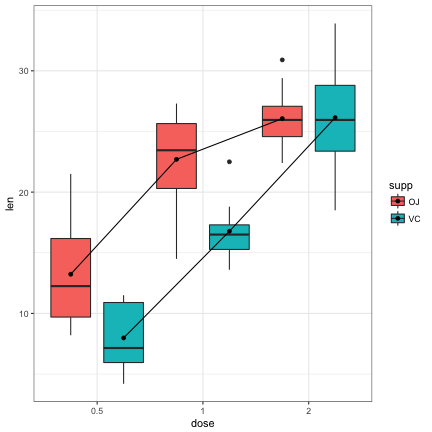
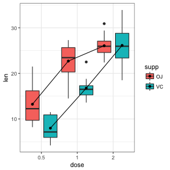
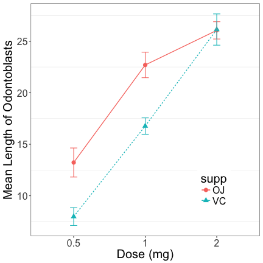

<style>
em {
  font-style: italic
}

strong {
  font-weight: bold;
}

sup {
  top: -0.5em;
  vertical-align: baseline;
  font-size: 75%;
  line-height: 0;
  position: relative;
}

article p {
  font-size: 20px;
}

article li.build {
  font-size: 18px;
}

article code {
  font-size: 14px;
}


</style>

## What are linear models?

- All the parametric tests you have learned thus far (t-tests, ANOVAs, regression) are special cases of what are known as **linear models**
 
 
- These tests make certain assumptions (normality, independence, randomness, equality of variance) about aspects of your data and the same assumptions apply to **linear models**


- These more complex and even more general methods that extend linear methods to deal with unequal variances (General Linear Models), non-normality (Generalized Linear Models), non-independence (Mixed Models) and non-linearity (Generalized Additive Models). 


- Before we see Linear models in their general form, let's explore some special instances of these models 


These instances are so special and commonly used, that they have their own specific names (multifactor ANOVA, multiple Regression, ANCOVA)

---  

## Multi-factor ANOVA (Analysis of Variance)

>- We have seen the **one-way ANOVA** to test for **differences in means** of one **numerical continuous dependent** variable across two or more groups/levels of one **categorical independent** variable.

>- What if we had more than one independent categorical variable?

>- Multifactor ANOVAs to the rescue


---

## Two-way ANOVA Example: Tooth Growth

To illustrate the utility of a two-way ANOVA we will use a built-in dataset in R called ```Tooth Growth```. 

Research was conducted to examine the effect of vitamin C on tooth growth in guinea pigs. Each animal was assigned to one of six groups (K=6) of 10 subjects each (n=10 ) for a total of 60 Guinea Pigs in all (N=60). The two variables that were manipulated in this study were the dosage level of Vitamin C (0.5, 1.0, or 2 mg/day) and the delivery method of the dosage (orange juice or absorbic acid [coded as “VC”]). The response is the length of odontoblasts (cells responsible for tooth growth).

The **dependent/response** variable is the length of the odontoblasts and there two **independent/explanatory** variables (**IV**), dose of Vit. C and delivery method. There are three different levels or groups of Vit. C and two different levels/groups of the delivery method.

The researchers were interested if (i) Vit. C dose levels had an effect on tooth growth; (ii) if different delivery methods had an effect on tooth growth. Additionally, we might be interested in knowing if certain combinations of delivery method and dose are signficantly better than others.

---

## Exploring the Tooth dataset

Let's have a quick look at the tooth dataset


```r
data("ToothGrowth")
head(ToothGrowth)
```

```
##    len supp dose
## 1  4.2   VC  0.5
## 2 11.5   VC  0.5
## 3  7.3   VC  0.5
## 4  5.8   VC  0.5
## 5  6.4   VC  0.5
## 6 10.0   VC  0.5
```

---

## Exploring the Tooth dataset: Quick Boxplots



We can see a trend of increasing growth with increasing dose. The pattern between different delivery methods is unclear and it is not clear cut which combinations might be best

---

## The two-way ANOVA model: Additive effects only

>- There are two possible formulations of two-way ANOVA model, the simpler one is called the **additive** model

>- In the additive model each single observation can be modelled as:
<center>$Y_{ijk} = \mu + \alpha_{i} + \beta_{i} + \epsilon_{ijk}$ </center>
<center>Where  $\mu$ is the grand mean of all data points  </center>
<center>  $\alpha_{i}$ is the fixed effect of level i for the 1st IV  </center>
<center>  $\beta_{j}$ is the fixed effect of level j for the 2nd IV  </center>
<center>  $\epsilon_{ijk}$ is the error term of the $k$th entry in subgroup $ij$ </center>

>- $\epsilon_{ijk}$ is assumed to be normally distributed with a mean of zero and a variance of $\sigma^{2}$

>- $\alpha$ (**dose** in this case) and $\beta$ (**delivery method** in this case) are also called the **main effects** and they are considered **fixed** in the sense they are estimated constants

>- There are two sets of hypothesis for the additive two-way ANOVA, one for each **IV**:
    - $H_0 : \mu_1 = \mu_2=...=\mu_k \ , H_a : not \ H_0$

--- 

## The two-way ANOVA model: Interaction effects

>- The interaction model includes an additional term other than the ones for the main effects: the **interaction term**. The definition of interaction is that the effect of a change in the level or value of one explanatory variable on the mean outcome depends on the level or value of another explanatory variable. **The interaction is only between different explanatory variables**

>- This model, referred to as a **full factorial design** is specified as:
<center>$Y_{ijk} = \mu + \alpha_{i} + \beta_{i} + (\alpha\beta)_{ij}+\epsilon_{ijk}$ </center>
<center>Where $(\alpha\beta)_{ij}$ is the interaction term  </center>

>- There are three sets of null/alternative hypothesis for this test:
  - The first two are the same as the additive only model from before
  - the third is $H_0$ : there is no interaction between the two IV's  $H_a$ : there is an interaction between the two IV's

---

## Which two-way ANOVA model is suitable for me?

>- In general you unless there is good *a priori* to not expect an interaction between the two IV's go for the additive/fractional-factorial model

>- You should still graphically explore your data to see for any hints for an interaction i.e. use EDA to pick your model

>- There is no harm in starting with a full factorial/interaction model and then dropping the interaction term if the ANOVA results deem it insignficant

---

## Two-way ANOVA: some more EDA

An additional bit of reconaissance we need to do is check if the data is **balanced** (equal number of observations in subgroups):

```r
#cross tabulate the two columns of IV
table(ToothGrowth$dose, ToothGrowth$supp)
```

```
##      
##       OJ VC
##   0.5 10 10
##   1   10 10
##   2   10 10
```

As we can see this data is **balanced**. In this case we can use the built-in functions for ANOVA in R. If our data is not balanced we need to use ANOVA functions from another package called ```car```.

For an explanation of why this is the case see [here](https://www.r-bloggers.com/anova-–-type-iiiiii-ss-explained/)

---

## The Two-way ANOVA in R


```r
tooth.aov <- aov(len ~ supp + dose + supp:dose, data = ToothGrowth)
summary(tooth.aov)
```

```
##             Df Sum Sq Mean Sq F value   Pr(>F)    
## supp         1  205.4   205.4  15.572 0.000231 ***
## dose         2 2426.4  1213.2  92.000  < 2e-16 ***
## supp:dose    2  108.3    54.2   4.107 0.021860 *  
## Residuals   54  712.1    13.2                     
## ---
## Signif. codes:  0 '***' 0.001 '**' 0.01 '*' 0.05 '.' 0.1 ' ' 1
```
We see that our Main Effect of Supplement, Main Effect of Dose, and Supplement x Dose Interaction are all statistically significant. We can reject the null hypothesis that there is no interaction between delivery method (supplement) and Vitamin C dosage (dose) on tooth growth in guinea pigs, $F_{2,54} = 4.107,\ p = .022$. We can also say that there are significant differences in the impact of delivery methods on tooth growth, $F_{1,54} = 15.572, \ p = 0.000231$, as well as significant differences in the impact of dosage on tooth growth, $F_{2,54} = 92,\ p = 0$.

---

### Interpreting results in the light of a significant interaction

>- Are those *p-values* really telling the whole truth? p-value interpretation: there are significant differences in the impact of delivery methods on tooth growth, $F_{1,54} = 15.572, p = 0.00023$

>- remember this plot:


>- The delivery methods are clearly not different at a dose level of 2!

>- interpreting null hypothesis about main effects can be problematic when the interaction term is significant!

---

## Post-hoc tests

>- If the interaction term is **not signficant**, you can conduct pairwise comparisions for each significant main effect.

>- If the interaction term **is signficant** focus on the pairwise comparisons of the all combinations of the IV's.

>- If the interaction term is signficant and so is a main effect it might mean that the groups for the main effect are only different in certain contexts (the delivery method seems to be significantly different only at low doses of Vitamin C)

---

### Post-hoc tests


```r
TukeyHSD(tooth.aov, which = "supp:dose")
```

```
##   Tukey multiple comparisons of means
##     95% family-wise confidence level
## 
## Fit: aov(formula = len ~ supp + dose + supp:dose, data = ToothGrowth)
## 
## $`supp:dose`
##                diff        lwr        upr     p adj
## VC:0.5-OJ:0.5 -5.25 -10.048124 -0.4518762 0.0242521
## OJ:1-OJ:0.5    9.47   4.671876 14.2681238 0.0000046
## VC:1-OJ:0.5    3.54  -1.258124  8.3381238 0.2640208
## OJ:2-OJ:0.5   12.83   8.031876 17.6281238 0.0000000
## VC:2-OJ:0.5   12.91   8.111876 17.7081238 0.0000000
## OJ:1-VC:0.5   14.72   9.921876 19.5181238 0.0000000
## VC:1-VC:0.5    8.79   3.991876 13.5881238 0.0000210
## OJ:2-VC:0.5   18.08  13.281876 22.8781238 0.0000000
## VC:2-VC:0.5   18.16  13.361876 22.9581238 0.0000000
## VC:1-OJ:1     -5.93 -10.728124 -1.1318762 0.0073930
## OJ:2-OJ:1      3.36  -1.438124  8.1581238 0.3187361
## VC:2-OJ:1      3.44  -1.358124  8.2381238 0.2936430
## OJ:2-VC:1      9.29   4.491876 14.0881238 0.0000069
## VC:2-VC:1      9.37   4.571876 14.1681238 0.0000058
## VC:2-OJ:2      0.08  -4.718124  4.8781238 1.0000000
```

---

## Visualizing a two-way ANOVA with interaction

Interaction plots are good way for understanding and visually displaying this data (but they don't show any  standard errors of the means or Confidence intervals)

```r
par(mfrow=c(1,2))
with(ToothGrowth, interaction.plot(supp, dose, len))
with(ToothGrowth, interaction.plot(dose, supp, len))
```


---

## A better visualization...



---

## We're not done yet! Checking Assumptions

>- We still need to check the assumptions of our analysis before setting on the results

>- The assumptions are (in order of importance in relation to the robustness of your results):
  1.  errors terms ($\epsilon_{ijk}$) are independent
  2.  equal variance of errors terms (homogeneity of variances)
  3.  The errors  are normally distributed.
  
>-  Remember independence implies that our data are not connected in any way. Knowing one observation doesn't tell us any information about the other. Imagine if the pigs came from 2 different families, there could be some dependence of tooth growth within members of the same family due to relatedness. There is no testing for independence! Just like there is no testing for random sampling/randomization. We need to be cognizant of this during the experimental design stage. 

---

## Error terms $\simeq$ Residuals!

>- the error terms $\epsilon_{ijk}$ are not actually known, but can be approximated.

>- the **residuals** ($r_{ijk}$) are the **estimates** of the error terms ($\epsilon_{ijk}$) in our model. They are estimated as follows
 <center> $r_{ijk} = Y_{ijk} - \bar{Y_{ij}} =  Y_{ijk} - \hat{\mu} + \hat{\alpha_{i}} + \hat{\beta_{i}} +\hat{(\alpha\beta)_{ij}}$ </center>
 
>- Notice i have put a hat on all the parameters, this is to emphasize that now we are dealing with values estimated from sampled/randomized data

>- $\bar{Y_{ij}}$ is the predicted or fitted value just like in linear regression

>- The residuals are **key** in checking model assumptions (just replace error term with residual in the previous slide), we will see them often.


---

## Assumption 2: Homogeneity of Variances

This assumption can also be recast in terms of the distribution of residuals. In this case the distributions of residuals should be the same across all levels of each IV and the fitted values ($bar{Y_{ij}}$)

```r
par(mfrow=c(1,3))
plot(tooth.aov,1) # you do not want the average of residuals to #deviate from zero at at data point on the x-axis
plot(ToothGrowth$dose, residuals(tooth.aov))
plot(ToothGrowth$supp, residuals(tooth.aov))
```


---

## Assumption 3: Normality of the residuals

This is fairly straight-forward, one suitable way is to make a QQ plot of the residuals.  In a perfect dataset, these values would create a perfect diagonal line.

```r
plot(tooth.aov,2)
```


>- But this is not too bad.. no heavy skew or bimodality

---

## Summary for MultiFactor ANOVAs

>- You can have 3-way, 4-way any-way ANOVAs you like, but interpreting 3rd order interactions is quite difficult

>- Multi-way ANOVAs are an excellent tool if you are conducting experimental work, are interested in the difference in means between some groups, and need to control for several categorical variables at once.

>- ANOVAs are intimately tied to Experimental Design, and usually courses/Books in Experimental design are usually books about different types of ANOVA

>- We will later see this same ANOVA model recast as a linear model.

---

## Multiple Linear Regression

>- Recall the model for simple linear regression:
      $$
      \begin{aligned}
       y_{i} = \beta_{0} + \beta_{1} + \epsilon_{i}
      \end{aligned}
      $$ 
        <center> Where $y$ is the response/dependent variable </center>
        <center> $x$ is the independent/predictor/explanatory variable </center>
        <center> $\beta_{0}$ and $\beta_{1}$ are the intercept and slope of a straight line relationship between $y$ and $x$ </center>
        <center> $\epsilon_{i}$ are the error terms or the variation unxeplained by our linear relationship, these are assumed to normally distributed with mean 0 and variance $\sigma^{2}$ </center>
        
>- You want to use a linear regression when you have  **numerical continuous** dependent and independent variables, you assume $y$ is a linear function $x$, and you want to estimate the parameters of this model ($\beta_{0}$, $\beta_{1}$) to define the relationship. You usually do one of two or both things with a linear regression: **(i)** assess whether your linear model of $y$ as a function of $x$ is a good fit (provide interpretable representations of the data that enhance our understanding of the phenomena under study?) and; **(ii)** predict future or unknown values (interpolate, extrapolation is not advisable)

---

## Uses of Linear regression

* The **prediction task** (ii; previous slide) has slightly different criteria criteria, needs for interpretability and standards for generalizability than the **modeling task** (i, previous slide)

* You will get to the see regression in the context of the prediction task more next week (AI/ML), here we will focus on the modeling task

* In modeling, our interest lies in parsimonious, interpretable representations of the data that enhance our understanding of the phenomena under study

*  What's the best model? one criteria: Whatever model connects the data to a true, parsimonious statement about what you're studying (Occam's razor).

* If you are performing highly controlled experiments, regression can also help explain causal relationships between variables, but this is an area of contentious debate.

---

## Estimating parameters of a Linear Regression

>- We have : 
  $$
  \begin{aligned}
  y  = \beta_{0} + \beta_{1} x_{i} + \epsilon_{i} \\
  \epsilon_{i} = y_{i} - \beta_{0} + \beta_{1} x_{i}  \\ 
  \end{aligned}
  $$

>- We want to minimize the errors, but the these will cancel out, so we square and then find the minimum of 
   $$
  \begin{aligned}
  \sum_{i=1}^{n} (y_{i} - \beta_{0} + \beta_{1} x_{i})^{2}
  \end{aligned}
  $$

>- The minimum of the above can be found by using calculus by taking partial derivatives setting them to zero and solving for both $\beta_{0}$ and $\beta_{1}$

>- This minimizing of the squared of the erros is sometimes referred to least squares estimation or **ordinary least squares** (OLS)

---

## Estimating parameters of a Multiple Linear Regression

>- We can add an arbitrary number of numerical continuous predictor/explanatory/independent variables (note in equations below I have dropped the $i$ subscript for individuals enteries, here $x$ and $y$ are column vectors with all the values) :
   $$
  \begin{aligned}
   y  = \beta_{0} + \beta_{1} x_{1} + \beta_{2} x_{2} + .. + \beta_{n} x_{n}  , 
  \end{aligned}
  $$ 
  <center> for $n$ predictor variables </center>
  
>- This can be written (and solved) more succinctly in matrix form:
  $$
  \begin{aligned}
   y = X \beta + \epsilon 
  \end{aligned}
  $$ 
$y$ is still a vector of all response/dependent values 
$X$ is now a matrix where each column are the values of a single predictor variable
$\beta$ is a vector where the first value is a slope and the rest are slopes for each predictor variable.

---

## Assumptions of a Multiple Linear Regression

This time let's start with the assumptions first, some of these should look somewhat familiar:

1. The model is **linear** in paramters (each term is either a constant or the product of a parameter and a predictor, the $\beta$'s cannot be exponents or products of one another)

2.  residuals (the estimates of the $/epsilon$ error terms) should be normally distributed

3. The variance of the residuals is constant (homoegeniety of variances or homoscedasticity)

4. The residuals are independent

5. Finally, multiple linear regression is **not robust** to **outliers** or **multicollinearity** (high correlation) between independent/predictor variables

---

## Example: Birth Weight Data

This data comes from an investigation conducted by Secher *et al.*, (1987). The birth
weight (BW) in grams for 107 babies was ascertained. For all babies,
both the abdominal (AD) and biparietal (BPD) diameters (in mm) were
measured shortly before birth using ultrasound .

The purpose of this study was to describe the relationship between
birthweight and these two ultrasound measurements in order to
establish a way to predict birthweight .

The dataset consists of the following variables:

bw: Birth weight of the baby in grams (the response/dependent variabale)

bpd: biparietal diameter (in mm), as determined by ultrasound (a potential predictor variable)

ad:  abdominal diameter (in mm), as determined by ultrasound  (a potential predictor variable)

id: identification of the mother (not sure if we can do anything with this)

<font size="-1"> From:  "Regression with Linear Predictors" by Per Kragh Andersen and Lene Theil Skovgaard published 2010 by Springer-Verlag </font>

----
### Exploratory Data Analysis


```r
#read in data from the web
birthw<-read.csv2("http://staff.pubhealth.ku.dk/~linearpredictors/datafiles/BirthWeight.csv",
  sep = ";",dec = ".",header = TRUE,colClasses = c("numeric","numeric","numeric"),
  na.strings=".")
#Draw some scatterplots
par(mfrow=c(1,3))
plot(birthw$bpd, birthw$bw); plot(birthw$ad, birthw$bw); plot(birthw$bpd, birthw$ad)
```


>- Relationships between bw and and IV's may not be linear

>- The IV's seem correlated (multicollinearity)

--- 

Physiological and morphological relationships often follow the power law :$y=a x^{b}$ which can be lineared with a log transformation.

```r
par(mfrow=c(1,2))
#for bpd
plot(log10(birthw$bpd), log10(birthw$bw));logbpd_model<-lm(log10(bw)~log10(bpd), data=birthw)
abline(logbpd_model)
#for ad
plot(log10(birthw$ad), log10(birthw$bw));logad_model<-lm(log10(bw)~log10(ad), data=birthw)
abline(logad_model)
```


--- 

## Building the Multiple Regression model

There are at least four possible models here

model 1: $\log_{10}(birthweight) = \beta_{0} + \beta_{1} \log_{10}(bpd) + \epsilon$

```r
logbpd_model<-lm(log10(bw)~log10(bpd), data=birthw)
summary(logbpd_model)
```

```
## 
## Call:
## lm(formula = log10(bw) ~ log10(bpd), data = birthw)
## 
## Residuals:
##       Min        1Q    Median        3Q       Max 
## -0.158422 -0.042235  0.005435  0.033452  0.222159 
## 
## Coefficients:
##             Estimate Std. Error t value Pr(>|t|)    
## (Intercept)  -3.0775     0.3936  -7.819 4.35e-12 ***
## log10(bpd)    3.3320     0.2017  16.516  < 2e-16 ***
## ---
## Signif. codes:  0 '***' 0.001 '**' 0.01 '*' 0.05 '.' 0.1 ' ' 1
## 
## Residual standard error: 0.06464 on 105 degrees of freedom
## Multiple R-squared:  0.7221,	Adjusted R-squared:  0.7194 
## F-statistic: 272.8 on 1 and 105 DF,  p-value: < 2.2e-16
```

---

model 2: $\log_{10}(birthweight) = \beta_{0} + \beta_{1} \log_{10}(ad) + \epsilon$

```r
logad_model<-lm(log10(bw)~log10(ad), data=birthw)
summary(logad_model)
```

```
## 
## Call:
## lm(formula = log10(bw) ~ log10(ad), data = birthw)
## 
## Residuals:
##       Min        1Q    Median        3Q       Max 
## -0.254322 -0.028702  0.000798  0.032482  0.210351 
## 
## Coefficients:
##             Estimate Std. Error t value Pr(>|t|)    
## (Intercept)  -1.0617     0.2216  -4.791 5.49e-06 ***
## log10(ad)     2.2365     0.1105  20.238  < 2e-16 ***
## ---
## Signif. codes:  0 '***' 0.001 '**' 0.01 '*' 0.05 '.' 0.1 ' ' 1
## 
## Residual standard error: 0.05539 on 105 degrees of freedom
## Multiple R-squared:  0.7959,	Adjusted R-squared:  0.794 
## F-statistic: 409.6 on 1 and 105 DF,  p-value: < 2.2e-16
```

---

model 3: $\log_{10}(birthweight) = \beta_{0} + \beta_{1} \log_{10}(bpd)+  \beta_{2} \log_{10}(ad) + \epsilon$

```r
#the additive model
logadd_model<-lm(log10(bw)~log10(bpd)+log10(ad), data=birthw)
summary(logadd_model)
```

```
## 
## Call:
## lm(formula = log10(bw) ~ log10(bpd) + log10(ad), data = birthw)
## 
## Residuals:
##       Min        1Q    Median        3Q       Max 
## -0.152325 -0.029275 -0.003438  0.024973  0.157907 
## 
## Coefficients:
##             Estimate Std. Error t value Pr(>|t|)    
## (Intercept)  -2.5456     0.2874  -8.859 2.36e-14 ***
## log10(bpd)    1.5519     0.2294   6.764 8.09e-10 ***
## log10(ad)     1.4667     0.1467   9.998  < 2e-16 ***
## ---
## Signif. codes:  0 '***' 0.001 '**' 0.01 '*' 0.05 '.' 0.1 ' ' 1
## 
## Residual standard error: 0.04638 on 104 degrees of freedom
## Multiple R-squared:  0.8583,	Adjusted R-squared:  0.8556 
## F-statistic: 314.9 on 2 and 104 DF,  p-value: < 2.2e-16
```

---

model 3: $\log_{10}(birthweight) = \beta_{0} + \beta_{1} \log_{10}(bpd)+  \beta_{2} \log_{10}(ad) + \beta_{3}\log_{10}(bpd)*\log_{10}(ad) + \epsilon$

```r
#including the interaction between continuous variables
logadd_model<-lm(log10(bw)~log10(bpd)+log10(ad)+log10(bpd):log10(ad), data=birthw)
#The following call is equivalent: lm(log10(bw)~log10(bpd)*log10(ad), data=birthw)
summary(logadd_model)
```

```
## 
## Call:
## lm(formula = log10(bw) ~ log10(bpd) + log10(ad) + log10(bpd):log10(ad), 
##     data = birthw)
## 
## Residuals:
##       Min        1Q    Median        3Q       Max 
## -0.133608 -0.031985 -0.000878  0.025499  0.156310 
## 
## Coefficients:
##                      Estimate Std. Error t value Pr(>|t|)  
## (Intercept)            14.062      7.843   1.793   0.0759 .
## log10(bpd)             -6.963      4.025  -1.730   0.0866 .
## log10(ad)              -7.119      4.054  -1.756   0.0821 .
## log10(bpd):log10(ad)    4.400      2.077   2.119   0.0365 *
## ---
## Signif. codes:  0 '***' 0.001 '**' 0.01 '*' 0.05 '.' 0.1 ' ' 1
## 
## Residual standard error: 0.04562 on 103 degrees of freedom
## Multiple R-squared:  0.8642,	Adjusted R-squared:  0.8602 
## F-statistic: 218.5 on 3 and 103 DF,  p-value: < 2.2e-16
```


---

### Summary of the models

|  model   | $\beta$ bpd | SE bpd | $\beta$ ad | SE ad |   $R^{2}  | residual SE |
|:--------:|------------:|-------:|-----------:|------:|----------:|------------:|
|model 1,2 |  3.33       | 0.202  |   2.24     | 0.111 | 0.72,.79  | 0.064, 0.055|

