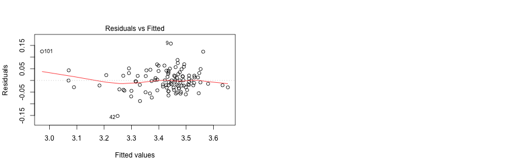
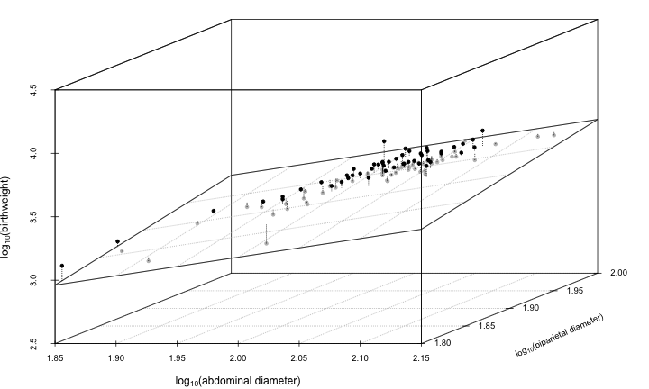

<style>
.title-slide {
  background-color: #FFFFFF; /* #EDE0CF; ; #CA9F9D*/
  /* background-image:url(http://goo.gl/EpXln); */
}

em {
  font-style: italic
}

strong {
  font-weight: bold;
}

sup {
  top: -0.5em;
  vertical-align: baseline;
  font-size: 75%;
  line-height: 0;
  position: relative;
}

article p {
  font-size: 20px;
}

article li.build {
  font-size: 18px;
}

article code {
  font-size: 14px;
}

</style>

## What are linear models?

- All the parametric tests you have learned thus far (t-tests, ANOVAs, regression) are special cases of what are known as **linear models**
 
 
- These tests make certain assumptions (normality, independence, randomness, equality of variance) about aspects of your data and the same assumptions apply to **linear models**


- There more complex and even more general methods that extend linear methods to deal with unequal variances (General Linear Models), non-normality (Generalized Linear Models), non-independence (Mixed Models) and non-linearity (Generalized Additive Models). 


- Before we see Linear models in their general form, let's explore some special instances of these models 


These instances are so special and commonly used, that they have their own specific names (multifactor ANOVA, multiple Regression, ANCOVA)

---  

## Multi-factor ANOVA (Analysis of Variance)

>- We have seen the **one-way ANOVA** to test for **differences in means** of one **numerical continuous dependent** variable across two or more groups/levels of one **categorical independent** variable.

>- What if we had more than one independent categorical variable?

>- Multifactor ANOVAs to the rescue


---

## Two-way ANOVA Example: Tooth Growth

To illustrate the utility of a two-way ANOVA we will use a built-in dataset in R called ```Tooth Growth```. 

Research was conducted to examine the effect of vitamin C on tooth growth in guinea pigs. Each animal was assigned to one of six groups (K=6) of 10 subjects each (n=10 ) for a total of 60 Guinea Pigs in all (N=60). The two variables that were manipulated in this study were the dosage level of Vitamin C (0.5, 1.0, or 2 mg/day) and the delivery method of the dosage (orange juice or absorbic acid [coded as “VC”]). The response is the length of odontoblasts (cells responsible for tooth growth).

The **dependent/response** variable is the length of the odontoblasts and there two **independent/explanatory** variables (**IVs**), dose of Vit. C and delivery method. There are three different levels or groups of Vit. C and two different levels/groups of the delivery method.

The researchers were interested if (i) Vit. C dose levels had an effect on tooth growth; (ii) if different delivery methods had an effect on tooth growth. Additionally, we might be interested in knowing if certain combinations of delivery method and dose are signficantly more effective than others.

---

## Exploring the Tooth dataset

Let's have a quick look at the tooth dataset


```r
data("ToothGrowth")
head(ToothGrowth)
```

```
##    len supp dose
## 1  4.2   VC  0.5
## 2 11.5   VC  0.5
## 3  7.3   VC  0.5
## 4  5.8   VC  0.5
## 5  6.4   VC  0.5
## 6 10.0   VC  0.5
```

---

## Exploring the Tooth dataset: Quick Boxplots


We can see a trend of increasing growth with increasing dose. The pattern between different delivery methods is unclear and it is not clear cut which combinations might be best.

---

## The two-way ANOVA model: Additive effects only

>- There are two possible formulations of two-way ANOVA model, the simpler one is called the **additive** model

>- In the additive model each single observation can be modelled as:
<center>$Y_{ijk} = \mu + \alpha_{i} + \beta_{i} + \epsilon_{ijk}$ </center>
<center>Where  $\mu$ is the grand mean of all data points  </center>
<center>  $\alpha_{i}$ is the fixed effect of level i for the 1st IV  </center>
<center>  $\beta_{j}$ is the fixed effect of level j for the 2nd IV  </center>
<center>  $\epsilon_{ijk}$ is the error term of the $k$th entry in subgroup $ij$ </center>

>- $\epsilon_{ijk}$ is assumed to be normally distributed with a mean of zero and a variance of $\sigma^{2}$

>- $\alpha$ (**dose** in this case) and $\beta$ (**delivery method** in this case) are also called the **main effects** and they are considered **fixed** in the sense they are estimated constants.

>- There are two sets of hypothesis for the additive two-way ANOVA, one for each **IV**:
    - $H_0 : \mu_1 = \mu_2=...=\mu_k \ , H_a : not \ H_0$

--- 

## The two-way ANOVA model: Interaction effects

>- The interaction model includes an additional term other than the ones for the main effects: the **interaction term**. The definition of interaction is that the effect of a change in the level or value of one explanatory variable on the mean response depends on the level or value of another explanatory variable. **The interaction is only between different explanatory variables**

>- This model, referred to as a **full factorial design** is specified as:
<center>$Y_{ijk} = \mu + \alpha_{i} + \beta_{i} + (\alpha\beta)_{ij}+\epsilon_{ijk}$ </center>
<center>Where $(\alpha\beta)_{ij}$ is the interaction term  </center>

>- There are three sets of null/alternative hypothesis for this test:
  - The first two are the same as the additive only model from before
  - the third is $H_0$ : there is no interaction between the two IV's  $H_a$ : there is an interaction between the two IV's

---

## Which two-way ANOVA model is suitable for me?

>- In general, unless there is good *a priori* reason to not expect an interaction between the two IV's go for the additive/fractional-factorial model

>- You should still graphically explore your data to see for any hints for an interaction i.e. use EDA to pick your model

>- There is no harm in starting with a full factorial/interaction model and then dropping the interaction term if the ANOVA results deem it insignficant

---

### Two-way ANOVA: some more EDA

An additional bit of reconaissance we need to do is check if the data is **balanced** (equal number of observations in subgroups):

```r
#cross tabulate the two columns of IV
table(ToothGrowth$dose, ToothGrowth$supp)
```

```
##      
##       OJ VC
##   0.5 10 10
##   1   10 10
##   2   10 10
```

As we can see this data is **balanced**. In this case we can use the built-in functions for ANOVA in R. If our data is **not balanced** we need to use ANOVA functions from another package called ```car```.

For an explanation of why this is the case see and how to use ANOVA functions from the ```car``` package [here](https://www.r-bloggers.com/anova-–-type-iiiiii-ss-explained/)

Alternatively, you can analyse it as a linear model (see the post-script)

---

## The Two-way ANOVA in R


```r
tooth.aov <- aov(len ~ supp + dose + supp:dose, data = ToothGrowth)
summary(tooth.aov)
```

```
## Df Sum Sq Mean Sq F value Pr(>F)
## supp 1 205.4 205.4 15.572 0.000231 ***
## dose 2 2426.4 1213.2 92.000 < 2e-16 ***
## supp:dose 2 108.3 54.2 4.107 0.021860 *
## Residuals 54 712.1 13.2
## ---
## Signif. codes: 0 '***' 0.001 '**' 0.01 '*' 0.05 '.' 0.1
' ' 1
```

This is the 2-way ANOVA table. **If we have interactions in our model, we want to start parsing this table from the interactions (the ```supp:dose``` line in this case)**. We can reject the null hypothesis that there is no interaction between delivery method (supplement) and Vitamin C dosage (dose) on tooth growth in guinea pigs, $F_{2,54} = 4.107,\ p = .022$
We see that our Main Effect of Supplement and  Main Effect of Dose are also signficant. If the interaction term was not signficcant it would be easy to interpret signficance of the main effects (at least of the group means for each main effect is different), but with a signficant interaction , signficant main effects can be difficult to interpret.

---

### Interpreting results in the light of a significant interaction

>- Are those *p-values* really telling the whole truth? p-value interpretation: there are significant differences in the impact of delivery methods on tooth growth, $F_{1,54} = 15.572, p = 0.00023$

>- remember this plot:


>- The delivery methods are clearly not different at a dose level of 2!

>- interpreting null hypothesis about main effects can be problematic when the interaction term is significant!

--- &vcenter

### Interpreting ANOVAs from **interaction plots**


<font size="-1"> source: https://skeetersays.wordpress.com/2008/08/12/demystifying-statistics-on-the-interpretation-of-anova-effects/ </font>

---

## Post-hoc tests

>- If the interaction term is **not signficant**, you can conduct pairwise comparisions for each significant main effect.

>- If the interaction term **is signficant** focus on the pairwise comparisons of the all combinations of the IV's.

>- If the interaction term is signficant and so is a main effect it might mean that the groups for the main effect are only different in certain contexts (the delivery method seems to be significantly different only at low doses of Vitamin C)

---

### Post-hoc tests


```r
TukeyHSD(tooth.aov, which = "supp:dose")
```

```
## Tukey multiple comparisons of means
## 95% family-wise confidence level
##
## Fit: aov(formula = len ~ supp + dose + supp:dose, data =
ToothGrowth)
##
## $`supp:dose`
## diff lwr upr p adj
## VC:0.5-OJ:0.5 -5.25 -10.048124 -0.4518762 0.0242521
## OJ:1-OJ:0.5 9.47 4.671876 14.2681238 0.0000046
## VC:1-OJ:0.5 3.54 -1.258124 8.3381238 0.2640208
## OJ:2-OJ:0.5 12.83 8.031876 17.6281238 0.0000000
## VC:2-OJ:0.5 12.91 8.111876 17.7081238 0.0000000
## OJ:1-VC:0.5 14.72 9.921876 19.5181238 0.0000000
## VC:1-VC:0.5 8.79 3.991876 13.5881238 0.0000210
## OJ:2-VC:0.5 18.08 13.281876 22.8781238 0.0000000
## VC:2-VC:0.5 18.16 13.361876 22.9581238 0.0000000
## VC:1-OJ:1 -5.93 -10.728124 -1.1318762 0.0073930
## OJ:2-OJ:1 3.36 -1.438124 8.1581238 0.3187361
## VC:2-OJ:1 3.44 -1.358124 8.2381238 0.2936430
## OJ:2-VC:1 9.29 4.491876 14.0881238 0.0000069
## VC:2-VC:1 9.37 4.571876 14.1681238 0.0000058
## VC:2-OJ:2 0.08 -4.718124 4.8781238 1.0000000
```

---

## Visualizing a two-way ANOVA with interaction

Interaction plots are good way for understanding and visually displaying this data (but they don't show any  standard errors of the means or Confidence intervals). **Note** the lines don't mean anything they are just visual aids.

```r
par(mfrow=c(1,2))
with(ToothGrowth, interaction.plot(supp, dose, len))
with(ToothGrowth, interaction.plot(dose, supp, len))
```


---

### A better visualization...


---

## We're not done yet! Checking Assumptions

>- We still need to check the assumptions of our analysis before setting on the results

>- The assumptions are (in order of importance in relation to the robustness of your results):
  1.  errors terms ($\epsilon_{ijk}$) are independent
  2.  equal variance of errors terms (homogeneity of variances)
  3.  The response variable is normally distributed or more generally the errors  are normally distributed.

>- In the ANOVA setting (explanatory variables are all categorical) there is no real way to check if our observations are independent 

>- The independence assumption must be satisfied during the experimental design stage. Obervations **between** levels/groups of a catergorical variable need to be independent. Additionally, observations **within** each levels/groups of a catergorical also need to be independent.

---

## Error terms $\simeq$ Residuals!

>- the error terms $\epsilon_{ijk}$ are not actually known, but can be estimated.

>- the **residuals** ($r_{ijk}$) are the **estimates** of the error terms ($\epsilon_{ijk}$) in our model. They are estimated as follows
 <center> $r_{ijk} = Y_{ijk} - \bar{Y_{ij}} =  Y_{ijk} - \hat{\mu} + \hat{\alpha_{i}} + \hat{\beta_{i}} +\hat{(\alpha\beta)_{ij}}$ </center>
 <center>$\text{where,}\ \bar{Y_{ij}} = \hat{\mu} + \hat{\alpha_{i}} + \hat{\beta_{i}} +\hat{(\alpha\beta)_{ij}}$ </center>
>- Notice I have put a hat on all the parameters, this is to emphasize that now we are dealing with values estimated from randomly sampled/randomly assigned data

>- $\bar{Y_{ij}}$ is the predicted or fitted value just like in linear regression

>- The residuals are **key** in checking model assumptions (just replace ther error term with residual in the previous slide), we will see them often.

---

### Assumption 2: Homogeneity of Variances

This assumption can also be recast in terms of the distribution of residuals. In this case the distributions of residuals should be the same across all levels the fitted values ($bar{Y_{ij}}$, means of each subgroup)

```r
par(mfrow=c(1,1))
plot(tooth.aov,1) # you do not want the average of residuals to deviate from zero at at data point on the x-axis
```


---

### Assumption 3: Normality of the residuals

This is fairly straight-forward, one suitable way is to make a QQ plot of the residuals.  In a perfect dataset, these values would create a perfect diagonal line.

```r
plot(tooth.aov,2)
```


>- But this is not too bad.. no heavy skew or bimodality

---

## Summary for MultiFactor ANOVAs

>- You can have 3-way, 4-way, any-way ANOVAs you like, but interpreting 3rd order interactions is quite difficult

>- Multi-way ANOVAs are an excellent tool if you are conducting experimental work, are interested in the difference in means between some groups, and need to evaluate the effect of or control for several categorical variables at once.

>- ANOVAs are intimately tied to Experimental Design, and usually courses/Books in Experimental design are usually books about different types of ANOVA

>- We will later see this same ANOVA model recast as a linear model.

>- As with linear models, there are advanced tools and techniques to handle your analysis when the assumptions are violated (you might see some of these next week)

---

## Multiple Linear Regression

>- Recall the model for simple linear regression:
      $$
      \begin{aligned}
       y_{i} = \beta_{0} + \beta_{1} + \epsilon_{i}
      \end{aligned}
      $$ 
        <center> Where $y$ is the response/dependent variable </center>
        <center> $x$ is the independent/predictor/explanatory variable </center>
        <center> $\beta_{0}$ and $\beta_{1}$ are the intercept and slope of a straight line relationship between $y$ and $x$ </center>
        <center> $\epsilon_{i}$ are the error terms or the variation unxeplained by our linear relationship, these are assumed to normally distributed with mean 0 and variance $\sigma^{2}$ </center>
        
>- You want to use a linear regression when you have  **numerical continuous** dependent and independent variables, you assume $y$ is a linear function of $x$, and you want to estimate the parameters of this model ($\beta_{0}$, $\beta_{1}$) to define the relationship. You usually do one of two or both things with a linear regression: **(i)** assess whether your linear model of $y$ as a function of $x$ is a good fit (provide interpretable representations of the data that enhance our understanding of the phenomena under study) and; **(ii)** predict future or unknown values (interpolate, extrapolation is not advisable)

---

## Uses of Linear regression

* The **prediction task** (ii; previous slide) has slightly different criteria and needs for interpretability and standards for generalizability than the **modeling task** (i, previous slide)

* You will get to the see regression in the context of the prediction task more next week (AI/ML), here we will focus on the modeling task

* In modeling, our interest lies in parsimonious, interpretable representations of the data that enhance our understanding of the phenomena under study

*  What's the best model? one criteria: Whatever model connects the data to a true, parsimonious statement about what you're studying (Occam's razor).

* If you are performing highly controlled experiments, regression can also help explain causal relationships between variables, but this is remains an area of contentious debate.

---

## Estimating parameters of a Linear Regression

>- We have : 
  $$
  \begin{aligned}
  y  = \beta_{0} + \beta_{1} x_{i} + \epsilon_{i} \\
  \epsilon_{i} = y_{i} - \beta_{0} + \beta_{1} x_{i}  \\ 
  \end{aligned}
  $$

>- We want to minimize the errors, but the these will cancel out, so we square and then find the minimum of 
   $$
  \begin{aligned}
  \sum_{i=1}^{n} (y_{i} - \beta_{0} + \beta_{1} x_{i})^{2}
  \end{aligned}
  $$

>- The minimum of the above can be found by using calculus by taking partial derivatives setting them to zero and solving for both $\beta_{0}$ and $\beta_{1}$

>- This minimizing of the squared of the erros is sometimes referred to least squares estimation or **ordinary least squares** (OLS)

---

### Estimating parameters of a Multiple Linear Regression

>- We can add an arbitrary number of numerical continuous predictor/explanatory/independent variables (note in equations below I have dropped the $i$ subscript for individuals enteries, here $x$ and $y$ are column vectors with all the values) :
   $$
  \begin{aligned}
   y  = \beta_{0} + \beta_{1} x_{1} + \beta_{2} x_{2} + .. + \beta_{n} x_{n}  , 
  \end{aligned}
  $$ 
  <center> for $n$ predictor variables </center>
  
>- This can be written (and solved) more succinctly in matrix form:
  $$
  \begin{aligned}
   y = X \beta + \epsilon 
  \end{aligned}
  $$ 
$y$ is still a vector of all response/dependent values 
$X$ is now a matrix where each column are the values of a single predictor variable
$\beta$ is a vector where the first value is a slope and the rest are slopes for each predictor variable.

---

## Assumptions of a Multiple Linear Regression

This time let's start with the assumptions first, some of these should look somewhat familiar:

1. The model is **linear** in paramters (each term is either a constant or the product of a parameter and a predictor, the $\beta$'s cannot be exponents or products of one another)

2. residuals (the estimates of the $\epsilon$ error terms) should be normally distributed

3. The variance of the residuals is constant (homoegeniety of variances or homoscedasticity)

4. The residuals are independent

5. Finally, multiple linear regression is **not robust** to **outliers** or **multicollinearity** (high correlation) between independent/predictor variables

1 and 5 are specific to continuous independent variables.

---

## Example: Birth Weight Data

This data comes from an investigation conducted by Secher *et al.*, (1987). The birth
weight (BW) in grams for 107 babies was ascertained. For all babies,
both the abdominal (AD) and biparietal (BPD) diameters (in mm) were
measured shortly before birth using ultrasound .

The purpose of this study was to describe the relationship between
birthweight and these two ultrasound measurements in order to
establish a way to predict birthweight .

The dataset consists of the following variables:

bw: Birth weight of the baby in grams (the response/dependent variabale)

bpd: biparietal diameter (in mm), as determined by ultrasound (a potential predictor variable)

ad:  abdominal diameter (in mm), as determined by ultrasound  (a potential predictor variable)

id: identification of the mother (not sure if we can do anything with this)

<font size="-1"> From:  "Regression with Linear Predictors" by Per Kragh Andersen and Lene Theil Skovgaard published 2010 by Springer-Verlag </font>

----

### Exploratory Data Analysis


```r
#read in data from the web
birthw<- read.csv2("http://staff.pubhealth.ku.dk/~linearpredictors/datafiles/BirthWeight.csv",
                     sep = ";",dec = ".",header = TRUE, colClasses = c("numeric","numeric","numeric"), na.strings="."
                     )
#Draw some scatterplots
par(mfrow=c(1,3))
plot(birthw$bpd, birthw$bw); plot(birthw$ad, birthw$bw); plot(birthw$bpd, birthw$ad)
```


>- Relationships between DV and and IV's may not be linear

>- The IV's seem correlated (multicollinearity)

--- 

Physiological and morphological relationships often follow the power law :$y=a x^{b}$ which can be lineared with a log-log transformation.

```r
par(mfrow=c(1,2))
#for bpd
plot(log10(birthw$bpd), log10(birthw$bw));logbpd_model<-lm(log10(bw)~log10(bpd), data=birthw)
abline(logbpd_model)
#for ad
plot(log10(birthw$ad), log10(birthw$bw));logad_model<-lm(log10(bw)~log10(ad), data=birthw)
abline(logad_model)
```


--- 

## Building the Multiple Regression model

There are at least four possible models here

model 1: $\log_{10}(birthweight) = \beta_{0} + \beta_{1} \log_{10}(bpd) + \epsilon$

```r
logbpd_model<-lm(log10(bw)~log10(bpd), data=birthw)
summary(logbpd_model)
```

```
## 
## Call:
## lm(formula = log10(bw) ~ log10(bpd), data = birthw)
## 
## Residuals:
##       Min        1Q    Median        3Q       Max 
## -0.158422 -0.042235  0.005435  0.033452  0.222159 
## 
## Coefficients:
##             Estimate Std. Error t value Pr(>|t|)    
## (Intercept)  -3.0775     0.3936  -7.819 4.35e-12 ***
## log10(bpd)    3.3320     0.2017  16.516  < 2e-16 ***
## ---
## Signif. codes:  0 '***' 0.001 '**' 0.01 '*' 0.05 '.' 0.1 ' ' 1
## 
## Residual standard error: 0.06464 on 105 degrees of freedom
## Multiple R-squared:  0.7221,	Adjusted R-squared:  0.7194 
## F-statistic: 272.8 on 1 and 105 DF,  p-value: < 2.2e-16
```

---

model 2: $\log_{10}(birthweight) = \beta_{0} + \beta_{1} \log_{10}(ad) + \epsilon$

```r
logad_model<-lm(log10(bw)~log10(ad), data=birthw)
summary(logad_model)
```

```
## 
## Call:
## lm(formula = log10(bw) ~ log10(ad), data = birthw)
## 
## Residuals:
##       Min        1Q    Median        3Q       Max 
## -0.254322 -0.028702  0.000798  0.032482  0.210351 
## 
## Coefficients:
##             Estimate Std. Error t value Pr(>|t|)    
## (Intercept)  -1.0617     0.2216  -4.791 5.49e-06 ***
## log10(ad)     2.2365     0.1105  20.238  < 2e-16 ***
## ---
## Signif. codes:  0 '***' 0.001 '**' 0.01 '*' 0.05 '.' 0.1 ' ' 1
## 
## Residual standard error: 0.05539 on 105 degrees of freedom
## Multiple R-squared:  0.7959,	Adjusted R-squared:  0.794 
## F-statistic: 409.6 on 1 and 105 DF,  p-value: < 2.2e-16
```

---

model 3: $\log_{10}(birthweight) = \beta_{0} + \beta_{1} \log_{10}(bpd)+  \beta_{2} \log_{10}(ad) + \epsilon$

```r
#the additive model
logadd_model<-lm(log10(bw)~log10(bpd)+log10(ad), data=birthw)
summary(logadd_model)
```

```
## 
## Call:
## lm(formula = log10(bw) ~ log10(bpd) + log10(ad), data = birthw)
## 
## Residuals:
##       Min        1Q    Median        3Q       Max 
## -0.152325 -0.029275 -0.003438  0.024973  0.157907 
## 
## Coefficients:
##             Estimate Std. Error t value Pr(>|t|)    
## (Intercept)  -2.5456     0.2874  -8.859 2.36e-14 ***
## log10(bpd)    1.5519     0.2294   6.764 8.09e-10 ***
## log10(ad)     1.4667     0.1467   9.998  < 2e-16 ***
## ---
## Signif. codes:  0 '***' 0.001 '**' 0.01 '*' 0.05 '.' 0.1 ' ' 1
## 
## Residual standard error: 0.04638 on 104 degrees of freedom
## Multiple R-squared:  0.8583,	Adjusted R-squared:  0.8556 
## F-statistic: 314.9 on 2 and 104 DF,  p-value: < 2.2e-16
```

---

An interaction between two continuous variables means that slope of one variable (against the response) changes for different values of the other variable. (make note )

model 4: $\log_{10}(birthweight) = \beta_{0} + \beta_{1} \log_{10}(bpd)+  \beta_{2} \log_{10}(ad) + \beta_{3}\log_{10}(bpd)*\log_{10}(ad) + \epsilon$

```r
#including the interaction between continuous variables
logmult_model<-lm(log10(bw)~log10(bpd)+log10(ad)+log10(bpd):log10(ad), data=birthw)
#The following call is equivalent: lm(log10(bw)~log10(bpd)*log10(ad), data=birthw)
summary(logmult_model)
```

```
## 
## Call:
## lm(formula = log10(bw) ~ log10(bpd) + log10(ad) + log10(bpd):log10(ad), 
##     data = birthw)
## 
## Residuals:
##       Min        1Q    Median        3Q       Max 
## -0.133608 -0.031985 -0.000878  0.025499  0.156310 
## 
## Coefficients:
##                      Estimate Std. Error t value Pr(>|t|)  
## (Intercept)            14.062      7.843   1.793   0.0759 .
## log10(bpd)             -6.963      4.025  -1.730   0.0866 .
## log10(ad)              -7.119      4.054  -1.756   0.0821 .
## log10(bpd):log10(ad)    4.400      2.077   2.119   0.0365 *
## ---
## Signif. codes:  0 '***' 0.001 '**' 0.01 '*' 0.05 '.' 0.1 ' ' 1
## 
## Residual standard error: 0.04562 on 103 degrees of freedom
## Multiple R-squared:  0.8642,	Adjusted R-squared:  0.8602 
## F-statistic: 218.5 on 3 and 103 DF,  p-value: < 2.2e-16
```

---

## Summary of the models

|  model   | $\beta$ bpd | SE bpd | $\beta$ ad | SE ad |   $R^{2}$  | residual SE |
|:--------:|:-----------:|:------:|-----------:|:-----:|:----------:|:-----------:|
|model 1,2 |  3.33       | 0.202  |   2.24     | 0.111 | 0.72,0.79  | 0.064, 0.055|
|model 3   |  1.55       | 0.229  |   1.46     | 0.146 | 0.856      | 0.04638     |
|model 4   | -6.96       | 4.025  |  -7.12     | 4.054 | 0.860      | 0.04562     |

>-  The adjusted $R^{2}$ penalizes for additional IV's the multiple $R^{2}$ will always improve with additional variables

>- For nested models, like these, we can use nested likelihood ratio test (these tests compare the goodness-of-fit of two more competing statistical models to the data at hand)

>- The **likelihood** of a given regression model for the data set is the  conditional probability  of observing the data given the model estimated parameters (slopes, intercepts) 

>- For non-nested models there are other approaches like the Akaike Information criteria (AIC), which you might see next week.

---

### likelihood ratio test for our models

note the ```anova()``` function is different from from the ```aov()``` function we used to make the ANOVA tables

```r
anova(logad_model, logadd_model, logmult_model)
```

```
## Analysis of Variance Table
## 
## Model 1: log10(bw) ~ log10(ad)
## Model 2: log10(bw) ~ log10(bpd) + log10(ad)
## Model 3: log10(bw) ~ log10(bpd) + log10(ad) + log10(bpd):log10(ad)
##   Res.Df     RSS Df Sum of Sq       F    Pr(>F)    
## 1    105 0.32211                                   
## 2    104 0.22370  1  0.098405 47.2838 4.865e-10 ***
## 3    103 0.21436  1  0.009344  4.4899    0.0365 *  
## ---
## Signif. codes:  0 '***' 0.001 '**' 0.01 '*' 0.05 '.' 0.1 ' ' 1
```

>- This suggests that the model with the three variables ($\log_{10}(bpd)$,$\log_{10}(ad)$, $\log_{10}(bpd)*\log_{10}(ad)$) is the best fit for the given data (*just marginally*), but there is big improvement in the case of the the shift from one variable (just ad) to including both variables (line)

>- What about the correlation between variables?

---

## Dealing with multicollinearity (correlated explanatory variables)

>- In the presence of multicollinearity, the estimated parameters (slopes) of the regression model becomes unstable (recall the output of the model with interaction term)

>- For a given explanatory variable, multicollinearity can assessed by computing a score called the **variance inflation factor** (or VIF), which measures how much the variance of a regression coefficient is inflated due to multicollinearity in the model

>- The smallest possible value of VIF is one (absence of multicollinearity). As a rule of thumb, a VIF value that exceeds 4-5 indicates a problematic amount of collinearity (James et al. 2014).

>- assessing multicollinearity is useful for the modeling task but may not be that important for predictive tasks. In the latter case you want to include certain variables, even if they dramatically inflate our variance, as long as they are good at predicting uknown outcomes.

---

### Calculating VIFs for our the additive model and the interaction model


```r
#we need the car package for this
if (!require(car, quietly=TRUE)) {install.packages("car");library(car)}
#vif for variables from the additive model
vif(logadd_model)
```

```
## log10(bpd)  log10(ad) 
##   2.512781   2.512781
```

```r
vif(logmult_model)
```

```
##           log10(bpd)            log10(ad) log10(bpd):log10(ad) 
##              799.031             1983.838             4728.313
```

>- The interaction variable greatly inflates variance for the other two variables (it makes sense that it should be highly correlated with both ad and bpd more than ad and bpd with one another)

>- Given this information, and the fact that the interaction variable makes the slope estimate unstable, model3: $\log_{10}(birthweight) = \beta_{0} + \beta_{1} \log_{10}(bpd)+  \beta_{2} \log_{10}(ad) + \epsilon$, might be the most parsimonious model for descrbing this relationship (but maybe not the best)

---

## Interpreting the Model coefficients

What do the model coeffients mean and how do they relate to the mathematical model. Let's look at the coefficients from our choosen model again:

```r
summary(logadd_model)$coefficients
```

```
##              Estimate Std. Error   t value     Pr(>|t|)
## (Intercept) -2.545618  0.2873540 -8.858823 2.360650e-14
## log10(bpd)   1.551943  0.2294493  6.763771 8.088579e-10
## log10(ad)    1.466662  0.1466910  9.998314 6.788350e-17
```

>- **Important** The following interpretation of the coefficients ($\beta$'s) is in terms of **percentages** *because* of the log-log transformation, if we had done linear regression on *untransformed* data, you can replace the % by the **actual units of the variables**. See [here](https://kenbenoit.net/assets/courses/ME104/logmodels2.pdf) for a good explanation of how to make sense of $\beta$'s when you log transform your data.

---

>- ```intercept``` = $\beta_{0}$: at log(1) mm  and log(1) mm ```ad``` the birth weight is ```10^-2.54= 0.0029``` grams. The intercept in a regression is often of no interest in intepretation but is presented here for completeness and is required for the model. 

>- ```log10(bpd)``` = $\beta_{1}$: increasing ```bpd``` by 1%, while holding ```ad``` constant,  increasing birthweight by 1.55%. To get an exact value. But this is in log units, which might not be easy to interpret. To get an answer of % change in terms of the original units ```10^(1.55 * log(1.01))=1.036``` means a 1% change in the original units of ```bpd``` leads to 3.6% increase in the original units of birth weight.

>- ```log10(ad)``` = $\beta_{2}$: increasing ```ad``` by 1%, while holding ```bpd``` constant,  increases the log of birthweight by 1.47%. Again this is in term of log units. in terms of the original units ```10^(1.47 * log(1.01))=1.034``` means a 1% change in the original units of ```bpd``` leads to a 3.4% increase in the original units of birth weight.

--- &vcenter

### What would interactions between two continuous explanatory variables look like?

To understand what the interaction means you can do use the model (with the interaction) to make predictions for birth weight for unknown values of bpd, while holding the ad value constant at different values (at 90, 100, 110 mm in this case)  


>- Theses three lines show the relationship between birth weight and bpd for three different fixed valued of ad. Notice the slopes look different.

<font size="-1"> source: https://publicifsv.sund.ku.dk/~linearpredictors/Illustrationer/thumbs/ </font>

---

## We're not done yet! Checking Assumptions

For our choosen model to be valid we still need to check assumptions
Checking normality of the residuals (assumption 2)


```r
par(mfrow=c(1,1))
qqnorm(rstandard(logadd_model), main="",
       ylab = "Standardised residual",
       xlab = "Normal quantile")
abline(0,1, lty = "21")
```


---

### The variance of the residuals is constant (assumption 3)

The residuals should be even distributed for all fitted/predicted values, however patterns on this plot can also be indicative of non-linearity in the data. Alternatively, a plot of *standardized* residuals against fitted values can also be used to check this assumption


```r
par(mfrow=c(1,2))
plot(logadd_model,1)
# or
#plot(logadd_model,3)
```



---

### The residuals are independent (assumption 4) 

Plot residuals against explanatory variables


```r
par(mfrow=c(1,2))
scatter.smooth(logmult_model$residuals ~ log10(birthw$bpd),evaluation = 1000, degree = 1, ylab = "Residual",ylim = c(-0.2, 0.2), 
              xlab =  expression(paste(log[10],"(biparietal diameter)", sep="")))
abline(h = 0, lty = "21")
scatter.smooth(logmult_model$residuals ~ log10(birthw$ad),evaluation = 1000,degree = 1, ylab = "Residual",ylim = c(-0.2, 0.2), 
               xlab = expression(paste(log[10],"(abdominal diameter)", sep="")))
```


---

### Check for outliers (part of assumption 5 along with multicollinearity)

Use Cook's distance to find influential points (or other methods you saw yesterday)

```r
par(mfrow=c(1,1))
plot(logadd_model,4)
```


 
>- There are a couple of outliers here, it might be prudent to see how our model estimates change without these parameters

---

## Visualizing and Reporting Multiple Regression

>- But this won't be possible for more than 2 explanatory variables (and in most use-cases you will have more than two expalantory variables)



---

### Reporting and visualizing results

* You can provide a table of slopes with standard errors/CI's for your final model (you can use the ```confint()``` function on your saved model to get CI's)

* if you have many variables you might consider an effects plot (coefficients with CI intervals):

```r
if (!require(jtools, quietly=TRUE)) {install.packages("jtools");library(jtools)}
#plots the coefficients with the 95% CI
plot_summs(logadd_model)
```


---

## Summary for birth weight data

>- The original data was really meant for a prediction task, being able to accurately predict birth weight from two ultrasound measurements

>- A different modelling strategy might be more suitable for the prediction task (you will see some of this next week)

>- The interaction term suggested that the slope of $bpd$ for $bw$ might be different for differing values of $ad$
  - you could visualize this interaction by performing several regressions for $bpd$ againt $bw$ at different values of $ad$, you can find out more [here](https://publicifsv.sund.ku.dk/~linearpredictors/?page=datasets&dataset=BirthWeight)
  - for more details on how to deal with and visualize interactions between continuous predictor variables look [here](https://rpubs.com/milesdwilliams15/328471)

---

## Summary for Multiple Regression

>- Multiple linear regression is a special instance of linear models when all explanatory variables are **numerical continuous**, just as multiway ANOVAs are a special case of linear models when all the explanatory variables are **categorical**

>- Multiple regression can be used either to model some phenomena, to understand the relationships between variables, or for predicting unknown outcomes or both (but there will be some trade-off generalizibility of a model vs accuracy of prediction)

>- In biology, continuous variables will rarely be linearly related in parameters (the power law is quite pervasive in biological systems). However linear models are simple and easy to interpret. You can often transform variables (like we did) to get to linear models. There are also methods such as **non-linear regression** and **Generalized additive models** that can work even when transformations won't.


---

## Analysis of Covariance

>- An Analysis of Covariance (ANCOVA) is a special case of linear models where we are interested in the effects of one **numerical continuous explanatory** variable and one **categorical explanatory** variable and their **interaction** (often the interaction is the important aspect of the analysis design). The response/dependent variable is *still* a numerical variable.

>- An analysis of covariance is also used in slighlty different instance where we want to *control* for the effects of some continuous variable while assessing the difference between some categorical variable of interest. Imagine trying to determing the effects of some treatment on the growth of an organism, but the organisms are at different sizes at the start. An ANCOVA would try to compare the means of the treatment while controlling for the different intial sizes.

>- In simpler terms an ANCOVA is a combination of simple linear regression and a one-way ANOVA

>- It also offers an insight into how linear models work in general. The flexibility of linear models lets us combine **any number** of categorical and numerical explanatory variables to model our phenomena of interest and/or make predictions.

>- Since the ANCOVA only has one numerical and one explanatory variable, it offers some easy interpretations. 

---

## The ANCOVA model and assumptions

>- The ANCOVA, tries to decompose each observation as follows:
  <center>$y_{ij} = \mu + \alpha_{i} + \beta x_{ij} + \epsilon_{ij}$</center>
  <center>$y_{ij} \ \text{is the jth observation under the ith categorical group }$</center>
  <center> $x_{ij} \ \text{is the jth observation of the continuous IV under the ith group}$</center>
  <center>$\bar{x} \ \text{is the grand mean of the continuous IV}$</center>
  <center>$\alpha_{i} \ \text{is the the effect of the ith level of the categorical IV}$</center>
  <center>$\beta \ \text{is the slope of the relation ship b/w the DV and the continuos IV}$</center>
  <center>$\epsilon_{ij} \ \text{the associated unobserved error term for the jth observation in the ith group}$</center>
 

>- There is **another** term here that is missing, this is the **interaction** term, but this time between a categorical and a numerical variable. The interaction term has the same interpretation as before (the effect of one IV on the response variable is dependent on another IV).

>- The assumptions of the ANCOVA are identical to those of the multiple linear regression, except we don't have to worry about multicollinearity, since we only have one numerical IV

---

## ANCOVA example: Tetrahymena data

In an experiment with the unicellar organism tetrahymena
(Hellung-Larsen et al., 1990), we are interested in determining how
cell concentration may affect the cell size (average cell diameter).

Moreover, the effect of adding glucose to the growth media is
investigated, by studying 19 cell cultures with no glucose added and
comparing to 32 cell cultures grown with glucose added.

Variable list:

glucose:	Presence of glucose in the growth media 0: No 1: Yes (IV/explanatory categorical variable with 2 groups)

concentration: 	Cell concentration (number of cells in 1 mL of the growth media) (IV/explanatory numerical continuous variable)

diameter: 	Average cell diameter (measured in µm) (DV/response variable)

<font size="-1"> From:  "Regression with Linear Predictors" by Per Kragh Andersen and Lene Theil Skovgaard published 2010 by Springer-Verlag </font>

---

## EDA


```r
#read in the data
tetrahymena <- read.csv2( "http://staff.pubhealth.ku.dk/~linearpredictors/datafiles/Tetrahymena.csv",
                         sep = ";",dec = ".", header=TRUE, colClasses = c("factor","numeric","numeric"),
                         na.strings=".")
#Plot the relation ship between cell size and concenrtation for both glucose levels and some regression lines for visuals
eda <- ggplot(tetrahymena, aes(x = concentration, y = diameter, colour = glucose)) +
geom_point(aes(colour = glucose)) + geom_smooth(method = "lm", se = FALSE) +
theme_light() + scale_color_brewer(palette = "Set1") + facet_grid(~glucose) ; eda
```


>- The relationship between diameter and concentration doesn't look that linear

----

### more EDA

A log transformation here also does the trick but this time we only need to apply the log transformation to the concentration IV and we get what looks like a pretty linear relationship


```r
eda + scale_x_continuous(trans = 'log10')
```


>- These lines seem like they fit well! What can we say about the effect of glucose on the diameter? and does the relationship between cell size and concentration change depending on whether glucose is present or not?

---

## Fitting the ANCOVA model to the tetrahymena data

>- Always fit the ANCOVA with the interaction term first:

```r
tet_model1 <- lm(diameter ~ log10(concentration) + glucose + log10(concentration):glucose, data=tetrahymena)
#equivalent to log10(diameter) ~ 
#let's just look at a summary of the model
summary(tet_model1)
```

```
## 
## Call:
## lm(formula = diameter ~ log10(concentration) + glucose + log10(concentration):glucose, 
##     data = tetrahymena)
## 
## Residuals:
##      Min       1Q   Median       3Q      Max 
## -1.27935 -0.19123 -0.02723  0.21369  0.89475 
## 
## Coefficients:
##                               Estimate Std. Error t value Pr(>|t|)    
## (Intercept)                    36.8048     0.9815  37.499   <2e-16 ***
## log10(concentration)           -3.0092     0.2003 -15.022   <2e-16 ***
## glucose1                        0.7547     1.2110   0.623    0.536    
## log10(concentration):glucose1   0.1482     0.2464   0.602    0.550    
## ---
## Signif. codes:  0 '***' 0.001 '**' 0.01 '*' 0.05 '.' 0.1 ' ' 1
## 
## Residual standard error: 0.463 on 47 degrees of freedom
## Multiple R-squared:  0.9392,	Adjusted R-squared:  0.9353 
## F-statistic: 242.1 on 3 and 47 DF,  p-value: < 2.2e-16
```

---

### Interpreting the Model the coefficients

What do the coeffficients mean?

```r
summary(tet_model1)
```

```
## 
## Call:
## lm(formula = diameter ~ log10(concentration) + glucose + log10(concentration):glucose, 
##     data = tetrahymena)
## 
## Residuals:
##      Min       1Q   Median       3Q      Max 
## -1.27935 -0.19123 -0.02723  0.21369  0.89475 
## 
## Coefficients:
##                               Estimate Std. Error t value Pr(>|t|)    
## (Intercept)                    36.8048     0.9815  37.499   <2e-16 ***
## log10(concentration)           -3.0092     0.2003 -15.022   <2e-16 ***
## glucose1                        0.7547     1.2110   0.623    0.536    
## log10(concentration):glucose1   0.1482     0.2464   0.602    0.550    
## ---
## Signif. codes:  0 '***' 0.001 '**' 0.01 '*' 0.05 '.' 0.1 ' ' 1
## 
## Residual standard error: 0.463 on 47 degrees of freedom
## Multiple R-squared:  0.9392,	Adjusted R-squared:  0.9353 
## F-statistic: 242.1 on 3 and 47 DF,  p-value: < 2.2e-16
```

>- **For the following I'll talk in terms the log units of the concentration** and give a conceptual explanation of the coefficients. This might not be easy to digest for some people, so if you are interested in explanations in the original units For see the note on log models from the multiple linear regression model and [here](https://stats.idre.ucla.edu/other/mult-pkg/faq/general/faqhow-do-i-interpret-a-regression-model-when-some-variables-are-log-transformed/) as well.

---

>- ```(Intercept)```: under the no glucose (0) treatment and with a concentration of 0 cells/ml, cell diameter is 36.8 µm. In other words this would be the intercept for a simple linear regression of diameter on concentration for the subset of the data where there was no glucose treatment. (*how do I know this corresponds to the no glucose treatment?*)

>- ```log10(concentration)```: This is the slope for a simple linear regression of diameter on log10(concentration) for the subset of the data where there was no glucose treatment. There is -3.01 µm  *decrease* for every one *log* unit increase in concentration.

>- ```glucose1```: Under the glucose treatment (1) and for a  concentration of 0 cells/ml the diameter is 0.755 µm lower compared to no glucose treatment. In other words this is the difference in intercepts of two simple linear regressions of diameter on log10(concentration), one for the no glucose samples and one for the glucose treated samples. **Note** the standard error on this term

>- ```log10(concentration):glucose1```: the effect of concentration on diameter is higher by 0.1482 in the glucose condition compared to no glucose treatment. In other words the slope between concentration and diameter is ```-3.0092+0.1482 ``` in elevated temperature condition. **Note** the standard error on this term.

>- The relationship between diameter and cell concentration stays constant regardless of the prescence of glucose, but cells seem to acheive bigger size in the prescence of glucose. 


--- &vcenter

### What would a signficant interaction between a categorical and numerical explanatory variable look like?


* the numerical explanatory variable is often referred to as **covariate** in an ANCOVA context

<font size="-1"> source: https://newonlinecourses.science.psu.edu/stat509/node/101/ </font>

---

## Simplifying the model

Let's drop the interaction term (we have no reason to beleive the relationship between cell size and concentration changes in the prescence/abscence of glucose)

```r
tet_model2 <- lm(diameter ~ log10(concentration)+glucose, data=tetrahymena)
#let's just look at a summary of the coefficents to be brief
summary(tet_model2)$coefficients
```

```
##                       Estimate Std. Error   t value     Pr(>|t|)
## (Intercept)          36.327488  0.5740401  63.28388 6.684641e-48
## log10(concentration) -2.911248  0.1158458 -25.13038 2.824871e-29
## glucose1              1.478692  0.1332732  11.09520 7.564953e-15
```

```r
#since the two models we fit are nested we could use the likelehood ratio tests to see which is more apprpriate
anova(tet_model1, tet_model2)
```

```
## Analysis of Variance Table
## 
## Model 1: diameter ~ log10(concentration) + glucose + log10(concentration):glucose
## Model 2: diameter ~ log10(concentration) + glucose
##   Res.Df    RSS Df Sum of Sq      F Pr(>F)
## 1     47 10.073                           
## 2     48 10.151 -1  -0.07757 0.3619 0.5503
```

---

## Visualization


```r
ggplot(tetrahymena, aes(x = concentration, y = diameter, colour = glucose)) +
geom_point(aes(colour = glucose))+ geom_smooth(method = "lm", se = T) + theme_light() + scale_color_brewer(palette = "Set1") +  scale_x_continuous(trans = 'log10') + scale_y_continuous(trans = 'log10')
```


---

##  Summary

>- We have now seen a model that combines categorical and numerical **explanatory** variables. The response variable is still **numerical** in all cases.

>- ANOVAs, multiple linear regression and ANCOVA are special cases of the linear models (they are used a lot and hence have special names)

>- You can combine any number of catergorical and numerical explanatory variables in a model of the form:
  -$$
  \begin{aligned}
   y  = \beta_{0} + \beta_{1} x_{1} + \beta_{2} x_{2} + .. + \beta_{n} x_{n}  , \\
    y = X \beta + \epsilon 
  \end{aligned}
  $$
  - categorical $x$'s are usually represented by matrices with columns of 1,0's assigning group level identity
  - The matrix equation can be solved with well-established matrix techniques (OLS) to calculate the coefficients. 

---

### Assumptions are quite often violated

>- **dependence of residuals** - avoiding pseudoreplication and correlation with time and space, methods that deal with this are called **Mixed models**.

>- **heterogeneity of variances** - we use a more general method to solve for the intercepts called **General Least Squares** and these methods are referred to **General Linear Models**

>- **non-normality of data/residuals** - if a transformation doesn't work and it won't if your response variable is binary, categorical or ordinal you can use what are called **Generalized Linear Models**

>- For assumptions of multiple violations there are even broader methods such as **Generalized Linear Mixed Models** or **Generalized Additive Mixed Models**

>- The following is an excellent *practical* reference on all these methods:
  - Zuur et al. 2009. Mixed Effects Models and Extensions in Ecology with R. Springer (there might be a more updated edition.)

---

## Postscript running ANOVAs with the ```lm``` function

To show that anova and linear models are the same thing, we can visit the tooth growth 2 way ANOVA example and analyze the data using ```lm()``` instead of ```aov()``` like we did before

```r
data("ToothGrowth")
tooth.lm <- lm(len ~ supp + dose + supp:dose, data = ToothGrowth)
summary(tooth.lm)$coefficients
```

```
##              Estimate Std. Error   t value     Pr(>|t|)
## (Intercept) 11.550000   1.581394  7.303681 1.089558e-09
## suppVC      -8.255000   2.236429 -3.691152 5.073393e-04
## dose         7.811429   1.195422  6.534454 2.027753e-08
## suppVC:dose  3.904286   1.690582  2.309433 2.463136e-02
```

---

### What are coefficients in the ```lm()``` output and how do they correspond to the ANOVA model?

>- ```(Intercept)``: teeth are predicted to have a length of 13.23 under dose 0.5  and delivery method of OJ, this is our **baseline**. (*r chooses the baseline lexiographically but it can be manually changed)

>- ```suppVC``: teeth grow 5.25 shorter with 0.5 dose and delivery method of VC *compared to the baseline*.

>- ```dose1```: teeth grow 9.47 longer with dose 1 and delivery method of OJ compared to the baseline

>- ```dose2```: teeth grow 12.83 longer with dose 2 and delivery method of OJ compared to the baseline

>- ```suppVC:dose1```: effect of dose 1 on teeth with delivery method VC decreased by 0.68, compared to the effect of dose 1 and delivery method OJ. In other words, when the effect of using dose 1 was to increase teeth length by 9.47 with delivery method OJ, with the VC delivery method adding a dose of 1 lead to an average of  ```13.23 + 9.47 -5.25 -0.68 = 16.77``` in teeth length. See the next slide if things are still unclear

>- ```suppVC:dose2```: same as above for dose level 2. 

---

Calculate the means for each subgroup:

```r
#check the means
#make a new factor which is combination of supp and dose
ToothGrowth$suppDose <- with(ToothGrowth, interaction(supp,  dose))
#calculate the means for each of the six sub groups and compare to coefficents
subgrpmeans <-tapply(ToothGrowth$len, ToothGrowth$suppDose, mean)
```

Where do the interaction coefficients come from?

```r
#For suppVC:dose1:
#difference between dose 0.5 and 1 for OJ
OJ_05vs1 <- subgrpmeans[1]-subgrpmeans[3]
#difference between dose 0.5 and 1 for VC
VC_05vs1 <- subgrpmeans[2]-subgrpmeans[4]
#suppVC:dose1 coefficient reflects the diff b/w VC_05vs1 and OJ_05vs1
OJ_05vs1- VC_05vs1
```

```
## OJ.0.5 
##  -0.68
```

if the change from dose 0.5 to 1 was completely independent of the delivery method, then this number should be 0. It's pretty close to zero and the standard error for this is quite high (hence it is not signficant). However the last interaction term ```suppVC:dose2``` is signficantly different

---

How does the linear model formula code the categorical variables?

```r
head(model.matrix(tooth.lm), 5)
```

```
##   (Intercept) suppVC dose suppVC:dose
## 1           1      1  0.5         0.5
## 2           1      1  0.5         0.5
## 3           1      1  0.5         0.5
## 4           1      1  0.5         0.5
## 5           1      1  0.5         0.5
```

$\hat{y}=X \beta$ , where $\{y}$ are the values for lengths, we can solve for a vector of $\beta$'s
by rearraging the matrix form of the linear model to solve for the $\beta$'s vector

$\beta = (X^{t}X)^{-1}X^{t}y$

```r
#to get betas by matrix multiplication
X=model.matrix(tooth.lm)
y=solve(t(X)%*%X)%*%t(X)%*%ToothGrowth$len
```


