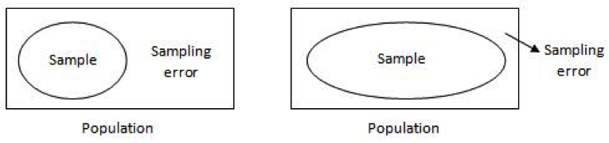
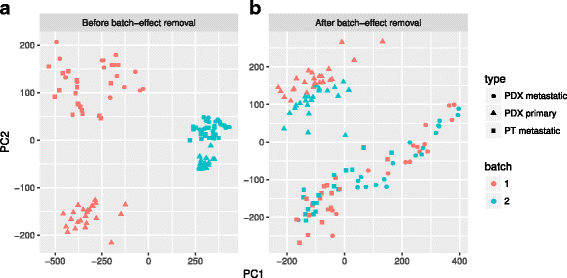
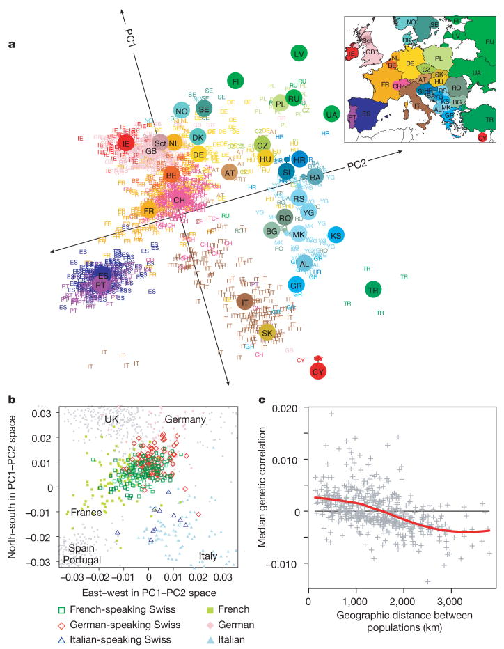

```{r setup, include=FALSE}
knitr::opts_chunk$set(echo = FALSE, fig.align="center")
```


## Course Organization 

Daily Schedule:

9:30 - 10:30 Lecture

10:45 - 11:45 Lecture 

12 -1 Lecture

2- onwards - Practical


There will be some variation on this schedule during the three days but we will always start with a lecture session.


## Course Organization 


Day 1: Introduction to Statistical Analysis, Introduction to the R programming language

Day 2: Programming in R, Basic Statistical Tests in R

Day 3: Advanced Data Wrangling in R, Introduction to Linear Models

Day 4 (morning only): Introduction to Generalized Linear Models (time permitting), Revision Exercises, Solutions

## Four Aspects of a Statistical Analysis <br /> <br /> 


1. Experimental Design
2. Exploratory Data Analysis (EDA)
3. Inference
4. *Visualisation*

* We will discusss these steps of statistical analysis in order. But we might take some detours along the way where an important concept needs to be highlighted. 

## Experimental Design {.build}

- This is the part of statistics that happens before your experiment.

- The main aim of experimental design is to help establish a connection 
between the **independent** and **dependent** variable(s).

- Usually we measure something and then take an average (or some other *statistic*),
  
    estimated value = expected/real value + error + bias

- Another major goal of experimental design is to:
      + avoid  bias
      + minimize sampling error
  
- **Independent variable**: These are the **factors**/variables you control in your experiment. Sometimes also known as the predictor/explanatory variables. **Dependent variable**: This is the response variable you are interested in.


## What is Bias?

- Most of the time will be working with a *sample* from a larger *population* (we can't measure the entire population for various reasons)

- We need a representative/*random* (or randomly assign subjects in an experiment) sample from the population to make valid inferences (almost all statistical tests you will ever use implicitly assume random sampling)

- **Sources of Bias**: convenience sampling, voluntary response, lack of blinding

## Avoiding Bias

- Use of control groups

- Randomization 

- Blinding

## Sampling and Sampling Error {.build}

- We almost always sample (or assign subjects) from a population (randomly I hope)

- Differences between sample means (e.g. $\bar{X}$, *s* ) and population means ($\mu$, $\sigma$) are the sampling error

-  As long as we sample from a population, some sampling error is unavoidable, but we can minimize it <center>  </center>

- **Blocking** is another way we minimize sampling error. This only works if we know some other variable (the block variable) adds uninteresting variability to our measurements

## Sampling and Sampling Distribution: Some Symbolic Definitions {.build}

- $\bar{X}$ = sample mean,  $\mu$ = population mean (usually unknown), $\mu_{\bar{X}}$ = mean of a sample of $\bar{X}$'s

- s = sample standard deviation ,  $\sigma$ = population standard deviation (usually unknown)

- $\sigma_{\bar{X}}$ = standard deviation of the sample means or the standar error of the mean (SEM)

- [sampling distributions in action](http://shiny.stat.calpoly.edu/Sampling_Distribution/)

## Central Limit Theorem (CLT) and Sampling Distributions

The CLT says that if you take many repeated samples from a population, and calculate the averages or sum of each one, the collection of those averages (or sums) will be normally distributed...and it doesn’t matter what the shape of the source distribution is!

If you are measuring something and taking the average, then the average will be normally distributed or nearly normally distributed

## Central Limit Theorem (CLT) and Sampling Distributions: Die example

- What is the underlying probability distrbution of a fair six sided die?
  
    - a uniform distribution with six equal possibilites

- What is the expected value or average of rolling a die many times?
  
    - 3.5
  
- What happens if we throw a single die 10000 times?
```{r, fig.height=4, echo =F}
DieOutcome <- sample(1:6,10000, replace= TRUE)
hist(DieOutcome, col ="light blue", breaks=(c(0.5, 1.5, 2.5, 3.5, 4.5 , 5.5, 6.5)))
abline(v=3.5, col = "red",lty=1, lwd=2)
```

## Central Limit Theorem (CLT) and Sampling Distributions: Die example

- Lets take a sample size of n=10 rolls from the previous simulation experiment (total of 10000 rolls of a single die) and **take the mean** of those 10 samples, repeat this 10000 times and plot a histogram of the means
```{r, echo =F}
x10 <- c()
k =10000
 for ( i in 1:k) {
 x10[i] = mean(sample(1:6,10, replace = TRUE))}
 hist(x10, col ="pink", main="Sample size =10",xlab ="Outcome of die roll")
 abline(v = mean(x10), col = "Red")
 abline(v = 3.5, col = "blue")
```

## Central Limit Theorem (CLT) and Sampling Distributions: Die example

-  What if I increase my sample size (n) ?
```{r, echo =F, fig.align="center"}
 x30 <- c()
 x100 <- c()
 x1000 <- c()
 k =10000
 for ( i in 1:k){
 x30[i] = mean(sample(1:6,30, replace = TRUE))
 x100[i] = mean(sample(1:6,100, replace = TRUE))
 x1000[i] = mean(sample(1:6,1000, replace = TRUE))
 }
 par(mfrow=c(1,3))
 hist(x30, col ="green",main="n=30",xlab ="die roll")
 abline(v = mean(x30), col = "blue")

 hist(x100, col ="light blue", main="n=100",xlab ="die roll")
 abline(v = mean(x100), col = "red")

 hist(x1000, col ="orange",main="n=1000",xlab ="die roll")
 abline(v = mean(x1000), col = "red")
```

## Central Limit Theorem (CLT) and Sampling Distributions

- Because of the CLT the normal distribution is (almost) everywhere and forms the basis of the many statistical tests

- The CLT states with increasing sample sizes (n > 30): $\mu_{\bar{X}}$ = $\mu$  (**law of large numbers**)  and,  $\sigma_{\bar{X}}$ = $\frac{\sigma}{\sqrt{n}}$
   
-  $\sigma_{\bar{X}}$ is the standard deviation of the sampling distribution of the sample means, it also referred to as the standard error

- $\sigma_{\bar{X}}$ reflects the uncertainty in our **estimate of the mean**, we can use the $\sigma_{\bar{X}}$ and what we know about the normal distribution (or a *t*-distribution because $\sigma$ wil be unkown) to calculate confidence intervals around our estimate

- in most cases  $\sigma$ will be unknown! but we have *s* an estimate of the standard deviation


#Exploratory Data Analysis

## Exploratory Data Analysis (or EDA)

- You've got some data, what should you do next?

- EDA is an approach to data analysis that uses (mostly) visual tools to summarize the main characteristics of your dataset

- You may already have some formal analysis task (e.g. hypothesis testing) that you wish to conduct with your data set but EDA is still **very useful**

- Why do EDA?

    - Transform or manipulate data so it is amenable for analysis, identify mistakes (data wrangling) 
    - Suggest hypotheses about the causes of observed phenomena (data driven hypothesis)
    - Assess assumptions on which statistical inference will be based (tests for normality etc.)
    - Identify relationships among explanatory variables 
    - Reduce Dimensionality
    - Get to know your data better

- further reading: Tukey, John Wilder (1977). Exploratory Data Analysis. Addison-Wesley. ISBN 978-0-201-07616-5.

## Graphical Tools of EDA

**barplots** for categorical data

**histogram, dot plots, stem and leaf plots** to see the shape of numerical distributions

**boxplots** to see summaries of a numerical distribution, useful in comparing distributions and identifying long and short-tailed distributions.

**normal probability plots** To see if data is approximately normal
  
**PCA, multidimensional scaling, clustering techniques** multivariate methods for dimensionality reduction

Plus many more.... 

## Boxplots for quick summaries of data
```{r, echo=F, fig.align="center" , fig.height=6, fig.width=6}
x <- rnorm(100, mean=-2, sd=1)
x <- c(x, rnorm(100, mean=2, sd=1))
#hist(x)
boxplot(x,  ylab="some measurement")
```

Box = interquartile range 25 to 75  percentile (dispersion of the middle 50% of the values)
Whisker= range (max-min)
Bar = **median**

## Boxplots don't always tell the whole story
```{r, echo=F, fig.align="center"}
x <- rnorm(100, mean=-2, sd=1)
x <- c(x, rnorm(100, mean=2, sd=1))
par(mfrow=c(1,2))
hist(x, xlab="some measurement")
boxplot(x,  ylab="some measurement")
```

## Violin or Beeswarm plots are a better alternative (show all your data)
```{r, fig.align="center"}
if (!require(grid, quietly=TRUE)) {
  install.packages("grid")
  library(grid)
}
x <- rnorm(100, mean=-2, sd=1)
x <- c(x, rnorm(100, mean=2, sd=1))
par(mfrow=c(1,2))
#beeswarm boxplot
if (!require(beeswarm, quietly=TRUE)) {
  install.packages("beeswarm")
  library(beeswarm)
}
boxplot(x, ylab="some measurement")
beeswarm(x, add=TRUE)

#plotting ggplot2 and base plot in same row
vp.Right <- viewport(height=unit(.6, "npc"), width=unit(0.5, "npc"), 
                           just=c("left","top"), 
                           y=0.75, x=0.5)
# Violin plot
if (!require(ggplot2, quietly=TRUE)) {
  install.packages("ggplot2")
  library(ggplot2)
}
X <- as.data.frame(x)

p <- ggplot(X, aes(1,x)) + ylab("some measurement") + xlab("")
p <-p + geom_violin()
print(p, vp=vp.Right)

```

## Histograms for looking at distributions of data

We will work with the "iris" data set on the following slides. This dataset includes measurements on 4 aspects of flower morphology for 3 different species of iris.
```{r iris, echo=F}
head(iris)
```

We might want to see if petal length is signficantly different among the species? We might want to see if the data are normally distributed.

```{r  echo=F, fig.height=4, fig.width=6, fig.align="center"}
par(mfrow=c(1,3))
hist(iris$Petal.Length[iris$Species=="setosa"], main="Petal Length for I. setosa")
hist(iris$Petal.Length[iris$Species=="versicolor"], main="Petal Length for I. versicolor")
hist(iris$Petal.Length[iris$Species=="virginica"], main="Petal Length for I. virginica")
```

## QQ plots for assessing normality

Another graphical method for assessing normality. A Q-Q plot is a scatterplot created by plotting two sets of quantiles against one another. If both sets of quantiles came from the same distribution, we should see the points forming a line that’s roughly straight. 

What are **quantiles**? These are often referred to as “percentiles”. These are points in your data below which a certain proportion of your data fall. For example, imagine the classic bell-curve standard Normal distribution with a mean of 0. The 0.5 quantile, or 50th percentile, is 0. Half the data lie below 0. That’s the peak of the hump in the curve. The 0.95 quantile, or 95th percentile, is about 1.64. 95 percent of the data lie below 1.64.

Q-Q plots take your sample data, sort it in ascending order, and then plot them versus quantiles calculated from a theoretical distribution. The number of quantiles is selected to match the size of your sample data. While Normal Q-Q Plots are the ones most often used in practice due to so many statistical methods assuming normality, Q-Q Plots can actually be created for any distribution.

## QQ plots for assessing normality for petal length for three iris species

```{r  echo=F, fig.height=4, fig.width=9,fig.align="center"}
par(mfrow=c(1,3))
qqnorm(iris$Petal.Length[iris$Species=="setosa"], main="Petal Length for I. setosa")
qqline(iris$Petal.Length[iris$Species=="setosa"])
qqnorm(iris$Petal.Length[iris$Species=="versicolor"], main="Petal Length for I. versicolor")
qqline(iris$Petal.Length[iris$Species=="versicolor"])
qqnorm(iris$Petal.Length[iris$Species=="virginica"], main="Petal Length for I. virginica")
qqline(iris$Petal.Length[iris$Species=="virginica"])
```

1. light tails (heavy center)         
2. skew to the left      
3. skew to the right

## Multiple boxplots for quick patterns

```{r, fig.align="center"}
par(mfrow=c(2,2))
boxplot(iris$Sepal.Length ~ iris$Species, main="Sepal Length")
boxplot(iris$Sepal.Width ~ iris$Species, main="Sepal Width")
boxplot(iris$Petal.Length ~ iris$Species, main="Petal Length")
boxplot(iris$Petal.Width ~ iris$Species, main="Petal Length")
```

## Scatterplots for patterns and evaluating relationships between variables

```{r , fig.height=7, fig.width=7, fig.align="center"}
pairs(iris[1:4], main = "Iris data red:setosa, green:versicolor, blue:virginca", pch = 21, bg = c("red", "green3", "blue")[unclass(iris$Species)], lower.panel=NULL, labels=c("SL","SW","PL","PW"), font.labels=2, cex.labels=4.5) 
```

## Principal Component Analysis for Patterns 

Principal Components Analysis is also referred to as a **dimensionality reduction** technique. It tries to find the orthogonal (uncorrelated) axes of variation in your dataset and then rotates your data set to align with maximal axes of variation (in descending order) 

```{r, warning=F, message=F, fig.align="center"}
library(dplyr)
library(grid)
library(cowplot) #too arrange plots in a grid
iris %>% select(-Species) %>% # remove Species column
  scale() %>%                 # scale to 0 mean and unit variance
  prcomp() ->                 # do PCA
  pca                         # store result as `pca`

pca_data <- data.frame(pca$x, Species=iris$Species)
p1<- ggplot(pca_data, aes(x=PC1, y=PC2, color=Species)) + geom_point()

# capture the rotation matrix in a data frame
rotation_data <- data.frame(pca$rotation, variable=row.names(pca$rotation))
# define a pleasing arrow style
arrow_style <- arrow(length = unit(0.05, "inches"),
                     type = "closed")
# now plot, using geom_segment() for arrows and geom_text for labels
p2 <- ggplot(rotation_data) + 
  geom_segment(aes(xend=PC1, yend=PC2), x=0, y=0, arrow=arrow_style) + 
  geom_text(aes(x=PC1, y=PC2, label=variable), hjust=0, size=3, color='red') + 
  xlim(-1.,1.25) + 
  ylim(-1.,1.) +
  coord_fixed() # fix aspect ratio to 1:1

percent <- 100*pca$sdev^2/sum(pca$sdev^2)
perc_data <- data.frame(percent=percent, PC=1:length(percent))
p3 <- ggplot(perc_data, aes(x=PC, y=percent)) + 
  geom_bar(stat="identity") + 
  geom_text(aes(label=round(percent, 2)), size=4, vjust=-.5) + 
  ylim(0, 80)

plot_grid(p1, p2, p3, labels = "AUTO")
```

## Principal Component Analysis for batch correction 

PCA can be used to get of systematic bias in data collection (over time, different machines etc.)

<center> </center>


<font size="-1">from: Zhu, X., Wolfgruber, T.K., Tasato, A. et al. Genome Med (2017) 9: 108. https://doi.org/10.1186/s13073-017-0492-3 </font>

## Princpal Component Analysis for general patterns in mutlivariate data

PCA is a **general pattern engine** that is useful to look for patterns in your data without any prior knowledge of groupings or clusters (in machine learning terminology is is unsupervised clustering)

<center></center>


<font size="-1"> from: Novembre J, Johnson T, Bryc K, et al. Genes mirror geography within Europe [published correction appears in Nature. 2008 Nov 13;456(7219):274]. Nature. 2008;456(7218):98–101. doi:10.1038/nature07331 </font>


## Other Clustering Techniques

```{r, echo=FALSE,out.width="49%",out.height="20%",fig.cap=" ",fig.show='hold',fig.align='center'}
knitr::include_graphics(c("images/heirarchical.png","images/entire_clust.svg"))
``` 

<font size="-1">from :http://gastrulation.stemcells.cam.ac.uk, 
Mishra, A.K., Duraisamy, G.S., Khare, M. et al. Genome-wide transcriptome profiling of transgenic hop (Humulus lupulus L.) constitutively overexpressing HlWRKY1 and HlWDR1 transcription factors. BMC Genomics 19, 739 (2018) doi:10.1186/s12864-018-5125-8 </font>


## Summary for EDA {.build}

> - Exploratory plots are "quick and dirty" (*these are not meant as final figures for your publications*)

> - Let you summarize the data (usually graphically) and highlight any broad features

> - Explore basic questions and hypotheses (and perhaps rule them out or find additional ones)

> - Suggest modeling strategies and check assumptions for the "next step"

> - Can identify additional patterns in the data

# Statistical Inference

## What is statistical inference?

* Statistical inference is the process of drawing formal conclusions from data. 

* We will define formal statistical inference as settings where one wants to infer facts about a population using noisy statistical data where uncertainty must be accounted for.

* Statistical inference requires navigating the set of assumptions and
tools and subsequently thinking about how to draw conclusions from data.

## Motivation for Statistical Inference

The two common forms of statistical inference are:

1. **Estimation**
2.  **Null hypothesis tests of significance (NHTS)**

* There are two forms of estimation:

    - Point estimation (maximally likely value for parameter, e.g. mean, proportion, slope)
    - Interval estimation (also called confidence interval for the parameters)

* Examples:
    
    - How much more (or less) likely is a patient to survive if treated with drug A rather than drug B? (estimation)
    - Does this drug improve survival rates? (testing)

## Frequentist vs. Bayesian Statisitics

1. Frequency probability: is the long run proportion of
 times an event occurs in independent, identically distributed 
 repetitions. (50.9% of all babies born in the UK are girls, **P**(randomly selected baby is girl)=0.509)
2. Frequency inference: uses frequency interpretations of probabilities
to control error rates. Answers questions like "What should I decide
given my data controlling the long run proportion of mistakes I make at
a tolerable level ($\alpha$)."
3. Bayesian probability: is the probability calculus of beliefs, given that beliefs follow certain rules. (**P**(previous life on mars)=0.5)
4. Bayesian inference: the use of Bayesian probability representation
of beliefs to perform inference. Answers questions like "Given my subjective beliefs and the objective information from the data, what should I believe now?"

<font size="-1"> from the Stasticial Inference course by Brian Caffo, Jeff Leek, Roger Peng, Johns Hopkins Bloomberg School of Public Health </font>

## Machine Learning vs. Statistical Inference

* The major difference between the two is their purpose:
    
    - ML : get most accurate predictions
    - SI : develop a general understanding of how a system behaves
    
* You will see more of ML and Bayesian Methods next week

* This week we will focus on Stastistical Inference in the Classical/Frequentist sense (which are still some of the most common methods employed)

## Data Types

A hierarchical classification of data types is useful in determining what statistical test/methodology to choose. 

* Categorical Variables:

    - binary (only two values)
    - regular categorical
    - ordinal (e.g. rankings)

* Numerical Variables:

     - continuous
     - discrete

## Null Hypothesis Signficance Testing

* Hypothesis testing is concerned with making decisions using data
* A null hypothesis is specified that represents the status quo,
  usually labeled $H_0$
* The null hypothesis is **assumed true** and statistical evidence is required
  to reject it in favor of a research or alternative hypothesis 

## The Hypothesis Testing Principle

* You have some observation (e.g. difference in means); 

* You have a probabilistic null model that you assume that generates such differences in means (t-distribution, normal disribution etc.); 

* You ask about the probability that the null model of your data would contain your specific observation.
\[ \textrm{p-value} = P(\textrm{Observation} \mathbin{\vert} \textrm{Null hypothesis}) \]

## Example

* Imagine you want to test the **research** hypothesis that sleeping less than 3 hours *impairs*  memory.

* You design an experiment where you randomly divide a number of people in 2 groups. All participants in the experiment learn a list of 50 words from a foreign language and a few hours later go to sleep under your supervision. Then, you wake them up 3 hours later (Group 1 participants) or 8 hours later (Group 2 participants) after they’ve fallen asleep and ask them to write down as many words from the list as they can remember. 

* In the end you calculate the the average number of words remembered by each group and the difference between the two averages is **5** words

* Your statistical hypothesis might take the following form:

    - $H_0 : \mu_1 = \mu_2$  or $\mu_1 - \mu_2 = 0$ 
    - $H_a : \mu_1 < \mu_2$
    - Where $\mu$'s are the population means of each group


## Hypothesis testing

The alternative hypotheses are typically of the form $<$, $>$ (**one-tailed**) or $\neq$ (**two-tailed**)

Note that there are four possible outcomes of our statistical decision process

|Truth | Decide | Result               |
|------|--------|----------------------|
|$H_0$ | $H_0$  | Correctly accept null| 
|$H_0$ | $H_a$  | Type I error         |
|$H_a$ | $H_a$  | Correctly reject null| 
|$H_a$ | $H_0$  | Type II error        |

## Analogies for understanding error rates 

* Consider a court of law; the null hypothesis is that the
  defendant is innocent
* We require evidence to reject the null hypothesis (convict)
* If we require little evidence, then we would increase the
  percentage of innocent people convicted (type I errors); however we
  would also increase the percentage of guilty people convicted
  (correctly rejecting the null)
* If we require a lot of evidence, then we increase the the
  percentage of innocent people let free (correctly accepting the
  null) while we would also increase the percentage of guilty people
  let free (type II errors)
  
<font size="-1"> from the Stasticial Inference course by Brian Caffo, Jeff Leek, Roger Peng, Johns Hopkins Bloomberg School of Public Health </font>

## Hypothesis Testing

* Returning to our sleep example

* A reasonable strategy would reject the null hypothesis if
  $\bar{X_{1}} - \bar{X_{2}}$ was **lesser** (in this case) than some constant, say $C$

* Typically, $C$ is chosen so that the probability of a Type I
  error, $\alpha$, is $.05$ (or some other relevant constant)
  
* $\alpha$ = Type I error rate = Probability of rejecting the null hypothesis when, in fact, the null hypothesis is correct

## Lets put some numbers to our sleep data

* We conducted experiment with a sample size of 15 people in each group (3 vs 8 hours of sleep) and we got the following recollection of words
  
  $X_{1} = 19, 18, 20, 21, 21, 20, 18, 19, 19, 20, 20, 20, 19, 21, 19$
  $X_{2} = 26, 25, 25, 24, 24, 25, 24, 27, 23, 24, 25, 26, 25, 25, 24$
 
  
* Our research hypothesis was that 3 hrs of sleep impairs of people's memory

* We translate this to a statistical hypothesis of:
  $H_o : \bar{X_{1}} - \bar{X_{2}} = 0$ or  $\bar{X_{1}} = \bar{X_{2}}$
  $H_a : \bar{X_{1}} < \bar{X_{2}}$
  
* What statistical test can we use to test this hypothesis?

## The two-sample t-test for difference in means of two groups

* When we don't know the population standard deviation ($\sigma$) (which is the case mose of the time), we use a t-test. If we do know the $\sigma$ and the sample size is >30 we can use a more powerful alternative called the $z-test$. I have never had the oppurtunity, thus far, to ever be able to use the $z-test$ in my research.

* Calculating the sample standard deviation(s) from the data leads to more uncertainty and t-distribution reflects this larger uncertainty (it has heavier tails)

* In other respects the $t$-distribution shares many of the same features of a normal distribution and the two become indistinguishable from each other at large sample sizes. 


## When to use a two-sample t-test

* You want to see if there a difference in means some numerical variable (number of words recollected) across a categorical variable (sleep amount) with two groups levels (3 hrs vs. 8 hrs.)

* Assumptions of a two-sample t-test
   
    - **Normality** the numerical variable should be normally distributed across the two groups. data can be transformed to normality if required. The test is robust to small deviations from normality. With small sample sizes it is extremely difficult to test for normality.
    - **Independent observations** data points need to be independent from one another. For a particular case of this violation e.g. in before/after studies where data across the groups are clearly not independent a *paired* t-test can be used
    - **Equal Variance** the two groups need to have equal variances. A t-test assuming unequal variance (Welch's t-test) can be used if variances are unequal
    - **Randomness** data are obtained from random sampling or a randomization procedure

    
## Performing a two-sample t-test

* Examining the mechanics of the t-test are instructive here as the procedure is similar for all NHST methods.

* First we calculate the test statistic:
  $t = \frac{\bar{X_{1}} -\bar{X_{2}}}{\sqrt{\frac{(n_{1}-1)s_{1}^{2}+(n_{2}-1)s_{2}^{2}}{n_{1}+n_{2}-2}(\frac{1}{n_{1}}+\frac{1}{n_{2}})}}$
   
* For our sleep dataset $t = -14.241$

* We could reject the null hypothesis if our $t =  -14.241$ is less than some some constant, say $C$, where $C$ corresponds to the a probability of the type 1 error rate (0.05) 

* We can look up the $C$ and our observed calculated $t$ in the appropriate $t$-distribution. The appropriate $t$-distribution would be described by $n_{1} + n_{2} -2$ *degrees of freedom* (28 in this case) - there will be a different $t$-distribution for different degrees of freedom

## A $t$-distribution with 28 degrees of freedom

* The $C$, with a lower-tail probability of 0.05, on a $t$-distribution with 28 degrees of freedom is roughly 1.701
```{r, echo=F, fig.height=3,fig.width=3}
if (!require(visualize, quietly=TRUE)) {
  install.packages("visualize")
  library(visualize)
}
visualize.t(stat=-1.701, df=28)
```

* The shaded blue region is called the critical region (for $\alpha = 0.05$), as long as our observed $t$ is in this region, we can reject the null hypothesis. We can also get an exact p-value for our $t$ using computers. In this case the exact p-value is 1.204e-14. $C$ is also called the critical value.
  
## A two-tailed alternative

* Instead of our original research hypothesis, we had the the following:
 sleeping less than 3 hours *effects* people’s memory.

* This has a less informative alternative (the null is still the same):
  $H_o : \bar{X_{1}} = \bar{X_{2}}$
  $H_a : \bar{X_{1}} \neq \bar{X_{2}}$
  
* For two-tailed alternatives we divide $\frac{\alpha}{2}$ and test for extremes in *both* tails of the distribution (we ignore the sign front of out t-statistic)


## Critical regions of a t-distribution with 28 degrees of freedom for a two-tailed alternative

```{r, echo=F, fig.height=3,fig.width=3}
if (!require(visualize, quietly=TRUE)) {
  install.packages("visualize")
  library(visualize)
}
visualize.t(stat=c(-2.048, 2.0484), df=28, section="tails")
```

* In this this case the critical region is at the extreme ends of the distribution

* The p-value for a two-tailed test with a symmetric distribution (like the $t$-distribution) will always be twice that of the one-tailed alternative

* one-tailed tests can be more powerful (lesser type II error) but *only use them if you have good reason to do so and always make the decision before doing the test*.

## More about Null hypothesis and interpreting p-values

* The null hypothesis was $\bar{X_{1}} - \bar{X_{2}} = 0$ 

* Тhe p-value is the conditional probability of observing a deviation from the null hypothesis which is greater than or equal to the one you actually observed

* \[ P(\textrm{Observed difference} \ge  5 \mathbin{\vert} \textrm{Actual difference} = 0) \]

* or in other words:
\[ \textrm{p-value} = P(\textrm{Observation} \mathbin{\vert} \textrm{Null hypothesis}) \]

* We use the p-value to reject or not reject the null hypothesis based on some threshold (type I error rate that we control, $\alpha$), *and that's all a p-value should be used for/interpreted as*

* For a biologically meaningful comparison you should show/discuss effect sizes (means with SEMs, difference in means with CI's or SEMs)

*  the NHST procedure guarantees that, if you applied it consistently to all null hypotheses that you test, **in the long run you will falsely reject at most 5% of the correct ones**


## And finally, why we can't accept the the alternative or prove our hypothesis

* Just because you reject the null hypotheis in your data, doesn't necessarily mean your **research** hypothesis is true

* the NHST is a probabilistic framework

* There can always be other explanations consistent with the difference you observed:
    
    - People in Group 2 slept more (your original hypothesis)
    - They happened to have better memory skills in general
    - People in Group 1 happened to be more distracted while memorizing the list of words
    - Some combination of these factors
    - Something entirely different
    
## Multiple testing Problem or what happens to the Type 1 error rate when you do many tests?

In modern Biolgy, particularly genomics, we are often conducting 100's-1000000's of tests at time. What does this mean for $\alpha$
<center></center>
<font size="-1">Source:https://xkcd.com/882/</font>

## Controlling Type 1 Error rates with FWER

* The **Family-Wise Error Rate** is the probability of having at least one False Positive (making at least one type I error) in a group of observations. 

* The Bonferroni correction sets the significance cut-off at $\alpha / n$, where n is the number of hypothesis tests you are performing. 

* For the Jelly bean example if you want to maintain an $\alpha = 0.05$ you can use per test threshold of $0.05 / 20 = 0.0025$

* Note this is quite *conservative* and can lead to *false negatives*

* There are other methods for FWER, but most are quite conservative

## FDR

* A better alternative particulary for genomic data (where you might do 1000-1000000s of tets) is the **False Discovery Rate**

* The FDR sets the porportion of false positives you are willing to live with out of all your **signficant**  test results

* Their are various procedures for controlling the FDR but the general method is generally attributed to Benjamini and Hochberg 1995.

* A FDR of 5% means at most 5% of your signficant results will be false positive

## Type II errors and the Power of a test

* Similarly, the type II (false negative) rate, which is usually denoted with the greek letter $\beta$ (beta), is the percentage of false null hypotheses that you failed to reject.

* in other words:
\[ \beta = P(\textrm{Not reject null hypothesis} \mathbin{\vert} \textrm{Null hypothesis is false}) \]

## Type II error rate and Statistical Power

* If the p-value controls the false positive rate, what controls the false negative rate and statistical power?

* The power of a test is defined as $1 - \beta$ and is also referred to as the **sensitivity** of the test.

* It turns out the power of a test to is more difficult to control than type I error rates, but usually depends on the following:
  
    - the effect size or difference between your groups
    - The variance of the data with which you’re testing the null hypothesis
    - the sample size
  
* In the real world you can only control one of these: *the sample size*

* There are various formulas that help you evaluate the optimal sample size, for a given test, guesstimated effect size and variance - these can be useful when designing your study.

## A note on non-parametric tests

* tests that assume an underlying distribution of your data and calculate parameters assuming that distribution (e.g. mean) are called parametric tests (t-tests, ANOVA, regression)

* if your data don't meet the assumptions (e.g. your data is highly non-normal) you can use what are called non-parametric tests

* example: the Mann-Whitney U test/Wilcoxon test is  a non-parametric alternative for the two sample t-test we just saw.

## Further Reading

* For those interested in a more mathematical/formal exposition to statistical inference:
   
    - Wasserman, LA (2004) All of Statistics. Springer
    - Miller, I (2013) John E. Freund's Mathematical Statistics with Applications. Pearson
   
* A great reference for Statistics and Using R (good for all levels):
  
    - Crawley, MJ (2012) The R Book. Wiley
  
* Beginnger to Intermediate Statistics in R 

    - Hector, A (2015) The New Statistics with R: An Introduction for Biologists. OUP

* [This](https://cran.r-project.org/doc/contrib/Verzani-SimpleR.pdf) is good online for learning/brushing up on basic statistical principles using R (you might want to skim through this if your basics are rusty)
  
* There are actually too many books and online resources to mention. Look around and find something that works for you.

