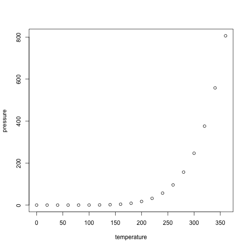

## Course Organization 


## Course Organization 


## Four Aspects of a Statistical Analysis <br /> <br /> 


1. Experimental Design
2. **Exploratory Data Analysis (EDA)**
3. **Inference**
4. Visualisation

#Experimental Design {data-background=#ff2222}


## Experimental Design {.build}

- This is the part of statistics that happens before your experiment.

- The main aim of experimental design is to help establish a causal connection 
between the **independent** and **dependent** variable(s).

- A major goal of experimental design is to:
      + avoid  bias
      + minimize sampling error
  
- **Independent variable**: These are the **factors**/variables you control in your experiment. Sometimes also known as the predictor variables. **Dependent variable**: This is the response variable you are interested in.


## What is Bias?

- Most of the time will be working with a *sample* from a larger *population* (we can't measure the entire population for various reasons)

- We need a representative/*random* sample from the population to make valid inferences (almost all statistical tests you will ever use implicitly assume random sampling)

- **Sources of Bias**: convenience sampling, voluntary response, lack of blinding

## Avoiding Bias

- Use of control groups

- Randomization 

- Blinding

## Sampling and Sampling Error {.build}

- We almost always sample from a population (randomly I hope)

- Differences between sample values (e.g. $\bar{X}$, *s* ) and population values ($\mu$, $\sigma$) are the sampling error

-  As long as we sample from a population some sampling error is unavoidable, but we can minimize it <center>  </center>

- **Blocking** is another way we minimize sampling error. This only works if we know some other variable (the block variable) adds uninteresting variability to our measurements

## Sampling and Sampling Distribution

## Confidence Intervals and  Quantifying Uncertainty in our Estimates


# Exploratory Data Analysis

## Exploratory Data Analysis (or EDA)

- You've got some data, what do you do next?


```r
summary(cars)
```

```
##      speed           dist       
##  Min.   : 4.0   Min.   :  2.00  
##  1st Qu.:12.0   1st Qu.: 26.00  
##  Median :15.0   Median : 36.00  
##  Mean   :15.4   Mean   : 42.98  
##  3rd Qu.:19.0   3rd Qu.: 56.00  
##  Max.   :25.0   Max.   :120.00
```

## Slide with Plot



